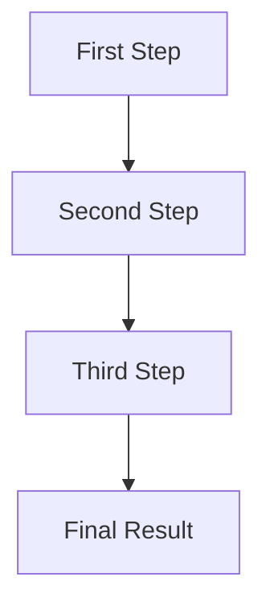

# Guide Title

> **Difficulty Level**: Beginner/Intermediate/Advanced

## What You'll Learn

In this guide, you will learn:
- Key point 1
- Key point 2
- Key point 3
- Key point 4

**Estimated Time**: XX minutes

## Prerequisites

Before starting this guide, make sure you have:

- [ ] Prerequisite 1 (with link if applicable)
- [ ] Prerequisite 2 (with link if applicable)
- [ ] Prerequisite 3 (with link if applicable)

## Quick Start for Experienced Developers

```php
// Essential code for experienced developers
// This should be a condensed version of the full implementation
// that experienced developers can quickly copy and adapt

// Example:
function example_function() {
    // Core implementation
    return $result;
}
```

> **Want more details?** Continue reading for a step-by-step explanation, or check out the [Quick Start Guide](path-to-quick-start.md) for a minimal implementation.

## Introduction

A brief introduction to the topic that explains:
- What problem this guide helps solve
- Why this is important for MainWP developers
- How this fits into the broader MainWP ecosystem



## Step 1: First Major Step

Clear explanation of the first step with context about why this step is necessary.

### Code Example

```php
/**
 * Example function with proper documentation
 *
 * @param string $param1 Description of parameter
 * @param array $param2 Description of parameter
 * @return mixed Description of return value
 */
function example_function($param1, $param2 = array()) {
    // Validate inputs
    if (empty($param1)) {
        return new WP_Error('missing_param', __('Parameter is required', 'text-domain'));
    }
    
    // Sanitize inputs
    $param1 = sanitize_text_field($param1);
    
    // Function implementation
    $result = do_something_with($param1, $param2);
    
    // Error handling
    if (is_wp_error($result)) {
        // Log error if WP_DEBUG_LOG is enabled
        if (defined('WP_DEBUG_LOG') && WP_DEBUG_LOG) {
            error_log(sprintf('[MainWP] Error in example_function: %s', $result->get_error_message()));
        }
        return $result;
    }
    
    return $result;
}
```

### Key Points

- Highlight important aspects of this step
- Explain any security considerations
- Note common pitfalls and how to avoid them

## Step 2: Second Major Step

Clear explanation of the second step with context about why this step is necessary.

### Code Example

```php
// Code for step 2
```

### Key Points

- Highlight important aspects of this step
- Explain any security considerations
- Note common pitfalls and how to avoid them

## Step 3: Third Major Step

Clear explanation of the third step with context about why this step is necessary.

### Code Example

```php
// Code for step 3
```

### Key Points

- Highlight important aspects of this step
- Explain any security considerations
- Note common pitfalls and how to avoid them

## Common Challenges and Solutions

### Challenge 1: Description of Common Issue

Explanation of the challenge and why it occurs.

**Solution**: Step-by-step solution to the challenge with code examples if applicable.

### Challenge 2: Description of Common Issue

Explanation of the challenge and why it occurs.

**Solution**: Step-by-step solution to the challenge with code examples if applicable.

## Best Practices

### Security Best Practices

- Always validate and sanitize user input
- Use capability checks with appropriate capabilities (`manage_options` instead of just `read`)
- Implement nonce verification for all form submissions
- Use `esc_html__()`, `esc_attr__()`, etc. for proper escaping

### Performance Best Practices

- Implement caching for expensive operations
- Use pagination for large datasets
- Follow WordPress coding standards for optimal performance
- Implement defensive programming techniques

## Testing Your Implementation

Steps to test the implementation:

1. Test step 1
2. Test step 2
3. Test step 3
4. Verify the expected outcome

## Next Steps

After completing this guide, you might want to explore:

- [Related Guide 1](path-to-related-guide-1.md)
- [Related Guide 2](path-to-related-guide-2.md)
- [Related Guide 3](path-to-related-guide-3.md)

## Related Resources

- [MainWP Dashboard API Documentation](../../source-code/dashboard/)
- [MainWP Child API Documentation](../../source-code/child/)
- [MainWP Dashboard Hooks](../../mainwp-hooks/dashboard/)
- [MainWP Child Hooks](../../mainwp-hooks/child/)
- [External Resource](https://example.com)
