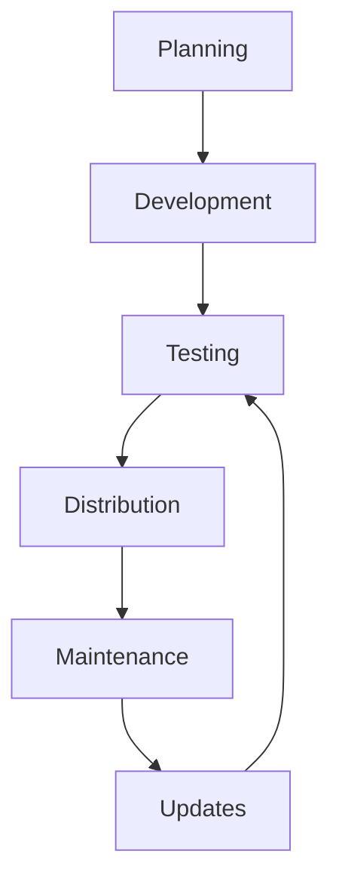

# Add-on Development Lifecycle

This guide explains the lifecycle of a MainWP add-on (extension or integration), from initial concept to ongoing maintenance. Understanding this lifecycle will help you plan, develop, and maintain successful add-ons.

## Understanding MainWP Add-on Types

Before diving into the lifecycle, it's important to understand the terminology:

- **Add-on**: The umbrella term for all MainWP plugins that extend functionality
- **Extension**: An add-on that works WITHOUT requiring a third-party plugin or API
- **Integration**: An add-on that works WITH a third-party plugin or API

This guide applies to both extensions and integrations, with specific considerations noted where relevant.

## Overview

The MainWP add-on development lifecycle consists of several distinct phases:

Each phase has specific goals, activities, and deliverables that contribute to creating a successful extension.

## 1. Planning Phase

The planning phase is where you define what your add-on will do and how it will work. This phase is critical for ensuring your add-on meets real user needs and integrates well with MainWP.

### Key Activities

1. **Market Research**: Identify user needs and potential competitors
2. **Feature Definition**: Determine the core functionality of your add-on
3. **Technical Assessment**: Evaluate technical feasibility and requirements
4. **Integration Planning**: Determine how your add-on will integrate with MainWP
5. **Resource Planning**: Estimate time, effort, and resources needed
6. **Add-on Type Decision**: Determine whether you need to build an extension or integration

   For integrations, additional planning is required:
   - Identify the third-party service or plugin you'll integrate with
   - Research API documentation and requirements
   - Evaluate authentication methods and security considerations
   - Plan for handling API rate limits and service disruptions

### Deliverables

- Add-on concept document
- Feature list and prioritization
- Technical requirements document
- Development timeline
- Third-party API requirements (for integrations)

### Best Practices

- **Focus on Solving Real Problems**: Ensure your add-on addresses actual pain points for MainWP users
- **Start Small**: Begin with a core set of features that deliver value, then expand
- **Consider Integration Points**: Plan how your add-on will interact with MainWP Dashboard and Child sites
- **Research Existing Add-ons**: Understand what's already available to avoid duplication or identify partnership opportunities
- **Choose the Right Add-on Type**: Carefully consider whether you need an extension or integration based on your requirements
- **Plan for API Changes** (for integrations): Consider how you'll handle third-party API changes or service disruptions

## 2. Development Phase

The development phase is where you build your add-on, transforming your plans into working code.

### Key Activities

1. **Environment Setup**: Create a development environment with MainWP Dashboard and Child sites
2. **Architecture Design**: Design the structure and components of your add-on
3. **Coding**: Implement the add-on's functionality
4. **Documentation**: Create inline code documentation and user documentation
5. **Internal Testing**: Perform ongoing testing during development

   For integrations, additional activities include:
   - Implementing API client and authentication
   - Creating fallback mechanisms for API failures
   - Developing data synchronization between MainWP and the third-party service
   - Implementing caching to reduce API calls

### Deliverables

- Working add-on code
- Technical documentation
- User documentation
- API client implementation (for integrations)

### Best Practices

- **Use the Development Extension**: Start with the [MainWP Development Extension](https://github.com/mainwp/mainwp-development-extension) as a template
- **Follow WordPress Coding Standards**: Adhere to [WordPress Coding Standards](https://developer.wordpress.org/coding-standards/wordpress-coding-standards/) for consistent, maintainable code
- **Implement Proper Error Handling**: Include robust error handling to ensure your add-on gracefully handles unexpected situations
- **Use Version Control**: Use Git or another version control system to track changes and collaborate
- **Create Modular Code**: Design your add-on with modular, reusable components
- **Document as You Go**: Write documentation alongside your code, not as an afterthought
- **Implement Robust API Error Handling** (for integrations): Handle API timeouts, rate limits, and service disruptions gracefully
- **Cache API Responses** (for integrations): Minimize API calls by implementing appropriate caching

## 3. Testing Phase

The testing phase ensures your add-on works correctly, integrates properly with MainWP, and provides a good user experience.

### Key Activities

1. **Functional Testing**: Verify all features work as expected
2. **Integration Testing**: Ensure proper integration with MainWP Dashboard and Child sites
3. **Compatibility Testing**: Test with different WordPress versions, themes, and plugins
4. **Performance Testing**: Evaluate the add-on's impact on site performance
5. **Security Testing**: Identify and address potential security vulnerabilities
6. **User Testing**: Get feedback from real users

   For integrations, additional testing includes:
   - API failure testing: Verify graceful handling of API timeouts and errors
   - Rate limit testing: Ensure your add-on respects API rate limits
   - Data synchronization testing: Verify data consistency between MainWP and the third-party service
   - Authentication testing: Ensure secure handling of API credentials

### Deliverables

- Test plan and test cases
- Bug reports and fixes
- Performance benchmarks
- Security assessment

### Best Practices

- **Create a Test Environment**: Set up a dedicated testing environment with multiple child sites
- **Test with Different Configurations**: Test with various WordPress versions, PHP versions, and server configurations
- **Automate Testing Where Possible**: Use automated tests for repetitive test cases
- **Perform Security Audits**: Review code for security vulnerabilities
- **Get External Feedback**: Have other developers or users test your add-on
- **Document Test Results**: Keep records of test results and fixes
- **Test API Edge Cases** (for integrations): Test with invalid API responses, rate limiting, and service outages
- **Implement Sandbox Testing** (for integrations): Use API sandbox environments when available

## 4. Distribution Phase

The distribution phase is where you package your add-on and make it available to users.

### Key Activities

1. **Packaging**: Prepare your add-on for distribution
2. **Documentation Finalization**: Complete user documentation
3. **Marketing Materials**: Create screenshots, videos, and promotional content
4. **Distribution Channel Setup**: Determine how you'll distribute your add-on
5. **Launch Planning**: Plan the launch of your add-on

   For integrations, additional activities include:
   - Documenting third-party API requirements and limitations
   - Creating setup guides for API credentials
   - Preparing support documentation for common API issues

### Deliverables

- Distribution package
- Complete user documentation
- Marketing materials
- Distribution channel presence
- API setup guides (for integrations)

### Distribution Options

1. **MainWP Add-ons Directory**: Official marketplace for MainWP add-ons
2. **Your Own Website**: Sell or distribute through your own site
3. **GitHub or Other Repositories**: Open-source distribution
4. **WordPress.org**: If your add-on has standalone functionality

### Best Practices

- **Create Clear Documentation**: Provide comprehensive documentation for installation, configuration, and usage
- **Include Screenshots and Videos**: Visual aids help users understand your add-on
- **Prepare Marketing Materials**: Create compelling descriptions and visuals
- **Plan Your Pricing Strategy**: Determine whether your add-on will be free, premium, or freemium
- **Consider Support Channels**: Decide how you'll provide support to users
- **Document API Requirements** (for integrations): Clearly explain what third-party accounts or plugins are required
- **Provide API Setup Guides** (for integrations): Include step-by-step instructions for obtaining API credentials

## 5. Maintenance Phase

The maintenance phase involves supporting your add-on, fixing bugs, and making minor improvements.

### Key Activities

1. **User Support**: Respond to user questions and issues
2. **Bug Fixing**: Address reported bugs and issues
3. **Minor Enhancements**: Implement small improvements
4. **Compatibility Updates**: Ensure compatibility with new MainWP and WordPress versions
5. **Performance Optimization**: Improve performance based on real-world usage

   For integrations, additional activities include:
   - Monitoring third-party API changes and updates
   - Adapting to API deprecations or new features
   - Addressing API-related issues reported by users

### Deliverables

- Bug fixes and patches
- Minor feature enhancements
- Updated documentation
- Compatibility updates

### Best Practices

- **Establish Support Channels**: Create clear channels for users to get help
- **Set Response Time Expectations**: Let users know how quickly they can expect support
- **Track Issues Systematically**: Use an issue tracking system to manage bug reports and feature requests
- **Communicate with Users**: Keep users informed about known issues and upcoming fixes
- **Monitor Performance**: Watch for performance issues in real-world usage
- **Stay Current with MainWP**: Keep up with MainWP updates and changes
- **Monitor API Changes** (for integrations): Subscribe to API change notifications and developer newsletters
- **Maintain API Compatibility** (for integrations): Quickly adapt to API changes to minimize disruption

## 6. Update Phase

The update phase involves developing significant new features or major changes to your add-on.

### Key Activities

1. **Feature Planning**: Plan new features based on user feedback and market needs
2. **Major Enhancements**: Implement significant new functionality
3. **Architecture Improvements**: Make major structural improvements
4. **Testing New Features**: Thoroughly test new functionality
5. **Update Documentation**: Update documentation to reflect new features
6. **Release Planning**: Plan and execute the release of updates

   For integrations, additional activities include:
   - Implementing support for new API features or versions
   - Redesigning integration architecture for better performance or reliability
   - Adding support for additional third-party services

### Deliverables

- New features and enhancements
- Updated extension package
- Updated documentation
- Release notes

### Best Practices

- **Prioritize Based on User Feedback**: Focus on features that users are requesting
- **Maintain Backward Compatibility**: Ensure updates don't break existing functionality
- **Use Semantic Versioning**: Follow [semantic versioning](https://semver.org/) for clear communication about the nature of updates
- **Create Detailed Release Notes**: Document what's new, what's changed, and any breaking changes
- **Test Thoroughly**: Test new features as rigorously as the initial release
- **Plan for Data Migration**: If updates change data structures, plan for migrating existing data
- **Coordinate with API Changes** (for integrations): Time major updates to coincide with third-party API changes when possible
- **Provide Migration Paths** (for integrations): Help users transition when third-party services make breaking changes

## Lifecycle Management Considerations

### Version Control

Using a version control system like Git is essential for managing your add-on's lifecycle:

- **Track Changes**: Keep a history of all code changes
- **Branch Management**: Use branches for features, fixes, and releases
- **Collaboration**: Enable multiple developers to work together
- **Rollback Capability**: Easily revert to previous versions if needed

### Documentation Management

Documentation should evolve alongside your add-on:

- **Code Documentation**: Keep inline code documentation up to date
- **User Documentation**: Update user guides with new features and changes
- **Changelog**: Maintain a detailed changelog of all versions
- **Known Issues**: Document known issues and workarounds
- **API Documentation** (for integrations): Document third-party API versions supported and known limitations

### Communication with Users

Maintaining clear communication with users throughout the lifecycle:

- **Release Announcements**: Inform users about new versions
- **Support Channels**: Provide accessible support options
- **Feedback Collection**: Actively seek and respond to user feedback
- **Roadmap Sharing**: Share your plans for future development

## Add-on Lifecycle Tools

Several tools can help manage your add-on's lifecycle:

1. **Version Control**: GitHub, GitLab, Bitbucket
2. **Issue Tracking**: GitHub Issues, JIRA, Trello
3. **Documentation**: GitHub Wiki, ReadTheDocs, WordPress Codex
4. **Continuous Integration**: GitHub Actions, Travis CI, Jenkins
5. **Testing**: PHPUnit, WP-CLI, Browser Testing Tools

## Case Studies: Add-on Lifecycle in Action

Let's look at hypothetical case studies of MainWP add-ons through their lifecycle:

### Extension Example: Client Reports Pro

#### Planning
A developer identifies that MainWP users need better reporting capabilities for client sites. They research existing solutions, define key features, and create a development plan for a "Client Reports Pro" extension.

#### Development
The developer uses the MainWP Development Extension as a starting point, implements the reporting features, creates a database structure for storing report templates, and builds a user interface for creating and scheduling reports.

#### Testing
The extension is tested with multiple child sites, various WordPress configurations, and different report types. Beta testers provide feedback on usability and feature requests.

#### Distribution
The developer creates comprehensive documentation, screenshots, and a demo video. They set up a website to sell the extension and establish a support system.

#### Maintenance
After launch, the developer responds to support requests, fixes bugs, and makes minor improvements based on user feedback.

#### Updates
Based on user requests, the developer plans and implements a major update that adds PDF export capabilities and more report templates.

### Integration Example: Analytics Connect

#### Planning
A developer notices that MainWP users want to see Google Analytics data directly in their MainWP Dashboard. They research the Google Analytics API, authentication requirements, and plan an integration that will connect MainWP sites with Google Analytics accounts.

#### Development
The developer creates an API client for Google Analytics, implements OAuth authentication, develops data synchronization between MainWP and Google Analytics, and builds dashboard widgets to display analytics data.

#### Testing
The integration is tested with various Google Analytics account configurations, different permission levels, and edge cases like API rate limiting. Beta testers provide feedback on the authentication process and data visualization.

#### Distribution
The developer creates documentation explaining how to connect Google Analytics accounts, obtain API credentials, and interpret the analytics data. They create marketing materials highlighting the time-saving benefits of viewing analytics directly in MainWP.

#### Maintenance
After launch, the developer monitors Google Analytics API changes, responds to authentication issues reported by users, and optimizes API calls to stay within rate limits.

#### Updates
When Google releases a new Analytics API version, the developer plans and implements support for the new API while maintaining backward compatibility with the old version.

## Conclusion

Understanding the MainWP add-on development lifecycle helps you create, distribute, and maintain successful extensions and integrations. By following best practices at each phase, you can create add-ons that provide real value to users and integrate seamlessly with the MainWP ecosystem.

Whether you're building a standalone extension or integrating with a third-party service, the same lifecycle principles apply, with additional considerations for integrations to ensure reliable connections with external services.

## Next Steps

Now that you understand the add-on development lifecycle, you can:

- [Set Up a Development Environment](../how-to/setup-environment.md)
- [Create a Basic MainWP Extension](../how-to/create-basic-extension.md) (standalone add-on)
- [Create a Basic MainWP Integration](../how-to/create-basic-integration.md) (third-party add-on)
- [Learn About the MainWP Development Extension](../how-to/mainwp-development-extension.md)

## Related Resources

- [MainWP Development Extension on GitHub](https://github.com/mainwp/mainwp-development-extension)
- [WordPress Plugin Developer Handbook](https://developer.wordpress.org/plugins/)
- [Semantic Versioning](https://semver.org/)
- [Working with Third-Party APIs](../how-to/third-party-apis.md)
- [API Integration Best Practices](../best-practices/api-integration.md)
