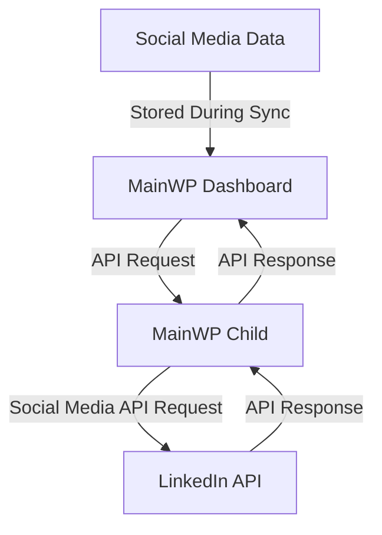

# Creating a MainWP Social Media Integration

This guide walks you through the process of creating a MainWP integration with social media platforms, allowing you to manage and monitor social media content across your MainWP network. We'll focus primarily on LinkedIn as our main example, with Bluesky as a simpler alternative.

## Quick Start for Experienced Developers

```php
<?php
/**
 * Plugin Name: MainWP LinkedIn Integration
 * Plugin URI: https://yourwebsite.com/mainwp-linkedin
 * Description: Integrates MainWP with LinkedIn for centralized social media management.
 * Version: 1.0.0
 * Author: Your Name
 * Author URI: https://yourwebsite.com
 * Text Domain: mainwp-linkedin
 */

namespace YourCompany\MainWPLinkedIn;

// Prevent direct access
if (!defined('ABSPATH')) {
    exit;
}

// Register the integration with MainWP
add_filter('mainwp_getextensions', function($extensions) {
    $extensions[] = array(
        'plugin' => __FILE__,
        'api' => 'MainWPLinkedIn',
        'mainwp' => true,
        'callback' => array('YourCompany\\MainWPLinkedIn\\MainWPLinkedIn', 'get_instance'),
        'name' => 'LinkedIn Integration'
    );
    return $extensions;
});

class MainWPLinkedIn {
    /** @var MainWPLinkedIn|null Instance */
    private static $instance = null;
    /** @var LinkedInAPIClient|null API Client */
    private $api_client = null;
    
    /**
     * Get singleton instance
     * @return MainWPLinkedIn Instance of the plugin
     */
    public static function get_instance() {
        if (null === self::$instance) {
            self::$instance = new self();
        }
        return self::$instance;
    }
    
    /**
     * Constructor
     */
    public function __construct() {
        // Initialize the integration
        add_action('admin_init', array($this, 'admin_init'));
        add_action('mainwp_admin_menu', array($this, 'init_menu'));
        
        // Hook into site sync to collect LinkedIn data
        add_action('mainwp_site_synced', array($this, 'site_synced'), 10, 2);
        
        // Add LinkedIn data to individual site view
        add_filter('mainwp_getsubpages_sites', array($this, 'add_linkedin_site_tab'), 10, 2);
    }
    
    /**
     * Initialize admin functionality
     */
    public function admin_init() {
        // Register settings
        register_setting('mainwp_linkedin_settings_group', 'mainwp_linkedin_settings');
    }
    
    /**
     * Initialize menu items
     */
    public function init_menu() {
        // Add LinkedIn dashboard page
        add_submenu_page(
            'mainwp_tab',
            __('LinkedIn', 'mainwp-linkedin'),
            __('LinkedIn', 'mainwp-linkedin'),
            'manage_options', // Use manage_options instead of read for better security
            'MainWPLinkedIn',
            array($this, 'render_dashboard_page')
        );
        
        // Add settings page
        add_submenu_page(
            'mainwp_tab',
            __('LinkedIn Settings', 'mainwp-linkedin'),
            __('LinkedIn Settings', 'mainwp-linkedin'),
            'manage_options', // Use manage_options instead of read for better security
            'MainWPLinkedInSettings',
            array($this, 'render_settings_page')
        );
    }
    
    /**
     * Process data after a site is synced
     * 
     * @param object $website The website object
     * @param array $data The sync data
     */
    public function site_synced($website, $data) {
        // Check if LinkedIn data is available
        if (isset($data['linkedin'])) {
            // Store the LinkedIn data for this site
            update_option('mainwp_linkedin_data_' . $website->id, $data['linkedin']);
        }
    }
    
    /**
     * Add LinkedIn tab to individual site view
     * 
     * @param array $subpages Current subpages
     * @param object $website The website object
     * @return array Modified subpages
     */
    public function add_linkedin_site_tab($subpages, $website) {
        $subpages[] = array(
            'title' => __('LinkedIn', 'mainwp-linkedin'),
            'slug' => 'LinkedIn',
            'callback' => array($this, 'render_site_linkedin_tab'),
        );
        return $subpages;
    }
    
    /**
     * Get LinkedIn API client for a specific site
     * 
     * @param int $website_id The website ID
     * @return LinkedInAPIClient|null API client or null on failure
     */
    private function get_api_client($website_id) {
        // Validate website ID
        $website_id = absint($website_id);
        if ($website_id <= 0) {
            return null;
        }
        
        // Get the website
        $website = \MainWP\Dashboard\MainWP_DB::instance()->get_website_by_id($website_id);
        if (!$website) {
            return null;
        }
        
        // Get API credentials from options
        $settings = get_option('mainwp_linkedin_settings', array());
        $site_settings = isset($settings[$website_id]) ? $settings[$website_id] : array();
        
        if (empty($site_settings['client_id']) || empty($site_settings['client_secret']) || empty($site_settings['access_token'])) {
            return null;
        }
        
        // Create API client
        return new LinkedInAPIClient(
            $website,
            $site_settings['client_id'],
            $site_settings['client_secret'],
            $site_settings['access_token']
        );
    }
    
    /**
     * Save API credentials for a site
     * 
     * @param int $website_id The website ID
     * @param string $client_id LinkedIn API client ID
     * @param string $client_secret LinkedIn API client secret
     * @param string $access_token LinkedIn API access token
     * @return bool Success or failure
     */
    public function save_api_credentials($website_id, $client_id, $client_secret, $access_token) {
        // Validate inputs
        $website_id = absint($website_id);
        if ($website_id <= 0) {
            return false;
        }
        
        $client_id = sanitize_text_field($client_id);
        $client_secret = sanitize_text_field($client_secret);
        $access_token = sanitize_text_field($access_token);
        
        // Get current settings
        $settings = get_option('mainwp_linkedin_settings', array());
        
        // Update settings for this site
        $settings[$website_id] = array(
            'client_id' => $client_id,
            'client_secret' => $client_secret,
            'access_token' => $access_token
        );
        
        // Save settings
        return update_option('mainwp_linkedin_settings', $settings);
    }
    
    // Additional methods for rendering pages and handling API requests...
}

/**
 * LinkedIn API Client
 */
class LinkedInAPIClient {
    /** @var object Website object */
    private $website;
    /** @var string Client ID */
    private $client_id;
    /** @var string Client secret */
    private $client_secret;
    /** @var string Access token */
    private $access_token;
    /** @var int Cache expiration in seconds */
    private $cache_expiration = 300; // 5 minutes
    
    /**
     * Constructor
     * 
     * @param object $website Website object
     * @param string $client_id LinkedIn API client ID
     * @param string $client_secret LinkedIn API client secret
     * @param string $access_token LinkedIn API access token
     */
    public function __construct($website, $client_id, $client_secret, $access_token) {
        $this->website = $website;
        $this->client_id = $client_id;
        $this->client_secret = $client_secret;
        $this->access_token = $access_token;
    }
    
    /**
     * Get company page information
     * 
     * @param string $company_id Company ID
     * @return array|WP_Error Company info or error
     */
    public function get_company_info($company_id) {
        // Check cache first
        $cache_key = 'mainwp_linkedin_company_' . $this->website->id . '_' . $company_id;
        $cached_data = get_transient($cache_key);
        
        if (false !== $cached_data) {
            return $cached_data;
        }
        
        $endpoint = "organizations/{$company_id}";
        $result = $this->make_api_request($endpoint);
        
        // Cache the result if not an error
        if (!is_wp_error($result)) {
            set_transient($cache_key, $result, $this->cache_expiration);
        }
        
        return $result;
    }
    
    /**
     * Get company page posts
     * 
     * @param string $company_id Company ID
     * @param array $args Query arguments
     * @return array|WP_Error Posts or error
     */
    public function get_company_posts($company_id, $args = array()) {
        // Ensure args is an array
        $args = is_array($args) ? $args : array();
        
        // Check cache first
        $cache_key = 'mainwp_linkedin_posts_' . $this->website->id . '_' . $company_id . '_' . md5(serialize($args));
        $cached_data = get_transient($cache_key);
        
        if (false !== $cached_data) {
            return $cached_data;
        }
        
        $endpoint = "organizations/{$company_id}/posts";
        $result = $this->make_api_request($endpoint, 'GET', $args);
        
        // Cache the result if not an error
        if (!is_wp_error($result)) {
            set_transient($cache_key, $result, $this->cache_expiration);
        }
        
        return $result;
    }
    
    /**
     * Create a company page post
     * 
     * @param string $company_id Company ID
     * @param array $post_data Post data
     * @return array|WP_Error Post data or error
     */
    public function create_company_post($company_id, $post_data) {
        // Clear posts cache
        $this->clear_posts_cache($company_id);
        
        $endpoint = "organizations/{$company_id}/posts";
        return $this->make_api_request($endpoint, 'POST', $post_data);
    }
    
    /**
     * Clear posts cache for a company
     * 
     * @param string $company_id Company ID
     */
    private function clear_posts_cache($company_id) {
        global $wpdb;
        
        // Find and delete all posts cache transients for this company
        $like = $wpdb->esc_like('_transient_mainwp_linkedin_posts_' . $this->website->id . '_' . $company_id) . '%';
        $wpdb->query($wpdb->prepare("DELETE FROM $wpdb->options WHERE option_name LIKE %s", $like));
    }
    
    /**
     * Make an API request to the LinkedIn REST API
     * 
     * @param string $endpoint API endpoint
     * @param string $method HTTP method
     * @param array $args Request arguments
     * @return array|WP_Error Response or error
     */
    private function make_api_request($endpoint, $method = 'GET', $args = array()) {
        // Prepare the request data for MainWP
        $data = array(
            'linkedin_api' => true,
            'endpoint' => $endpoint,
            'method' => $method,
            'args' => $args,
            'client_id' => $this->client_id,
            'client_secret' => $this->client_secret,
            'access_token' => $this->access_token
        );
        
        try {
            // Send the request through MainWP
            $information = \MainWP\Dashboard\MainWP_Connect::fetch_url_authed(
                $this->website,
                'linkedin_integration',
                $data
            );
            
            // Check for errors in the response
            if (is_array($information) && isset($information['error'])) {
                $error_message = $information['error'];
                // Log error if WP_DEBUG_LOG is enabled
                if (defined('WP_DEBUG_LOG') && WP_DEBUG_LOG) {
                    error_log(sprintf(
                        '[MainWP LinkedIn] API Error: %s (Endpoint: %s, Method: %s, Site ID: %d)',
                        $error_message,
                        $endpoint,
                        $method,
                        $this->website->id
                    ));
                }
                return new \WP_Error('api_error', $error_message);
            }
            
            return $information;
        } catch (\Exception $e) {
            $error_message = $e->getMessage();
            // Log exception if WP_DEBUG_LOG is enabled
            if (defined('WP_DEBUG_LOG') && WP_DEBUG_LOG) {
                error_log(sprintf(
                    '[MainWP LinkedIn] API Exception: %s (Endpoint: %s, Method: %s, Site ID: %d)',
                    $error_message,
                    $endpoint,
                    $method,
                    $this->website->id
                ));
            }
            return new \WP_Error('api_error', $error_message);
        }
    }
}
```

## Prerequisites

Before you begin creating a MainWP social media integration, ensure you have:

- A development environment with WordPress and MainWP Dashboard installed (see [Setting Up a Development Environment](setup-environment.md))
- LinkedIn Developer account with an application created
- LinkedIn API knowledge (familiarity with endpoints and authentication)
- Basic understanding of WordPress plugin development
- Familiarity with PHP object-oriented programming
- A code editor (like VS Code, PhpStorm, or Sublime Text)

## Integration Overview

A MainWP social media integration allows you to centrally manage and monitor social media content across your MainWP network. This provides several benefits:

- **Centralized Content Management**: Manage social media posts from a single dashboard
- **Bulk Operations**: Perform actions across multiple sites simultaneously
- **Unified Analytics**: View engagement and performance data across all sites
- **Consistent Branding**: Maintain consistent messaging across multiple properties
- **Scheduled Publishing**: Plan and schedule content in advance

### Data Flow Architecture

The integration works by communicating between the MainWP Dashboard and social media platforms via child sites:



## Step 1: Setting Up LinkedIn API Access

To communicate with LinkedIn, you'll need to set up API access:

### Creating a LinkedIn Application

1. Go to the [LinkedIn Developer Portal](https://www.linkedin.com/developers/)
2. Click "Create App"
3. Fill in the required information:
   - App name
   - Company page
   - App logo
   - Description
4. Click "Create App"
5. Under "Auth" tab, add authorized redirect URLs (your MainWP Dashboard URL)
6. Request the necessary API permissions:
   - r_organization_social
   - w_organization_social
   - r_liteprofile
7. Note your Client ID and Client Secret

### Implementing OAuth 2.0 Authentication

LinkedIn uses OAuth 2.0 for authentication. Here's how to implement it:

```php
/**
 * Initiate OAuth authentication flow
 */
public function initiate_oauth() {
    // Validate nonce
    check_admin_referer('mainwp_linkedin_oauth_nonce', 'mainwp_linkedin_oauth_nonce');
    
    // Validate website ID
    $website_id = isset($_GET['website_id']) ? absint($_GET['website_id']) : 0;
    if ($website_id <= 0) {
        wp_die('Invalid website ID');
    }
    
    // Get settings
    $settings = get_option('mainwp_linkedin_settings', array());
    $site_settings = isset($settings[$website_id]) ? $settings[$website_id] : array();
    
    if (empty($site_settings['client_id']) || empty($site_settings['client_secret'])) {
        wp_die('LinkedIn API credentials not configured');
    }
    
    // Generate state parameter to prevent CSRF
    $state = wp_generate_password(12, false);
    update_option('mainwp_linkedin_oauth_state_' . $website_id, $state);
    
    // Build authorization URL
    $auth_url = add_query_arg(
        array(
            'response_type' => 'code',
            'client_id' => $site_settings['client_id'],
            'redirect_uri' => urlencode(admin_url('admin.php?page=MainWPLinkedInSettings&action=oauth_callback&website_id=' . $website_id)),
            'state' => $state,
            'scope' => 'r_organization_social w_organization_social r_liteprofile'
        ),
        'https://www.linkedin.com/oauth/v2/authorization'
    );
    
    // Redirect to LinkedIn authorization page
    wp_redirect($auth_url);
    exit;
}

/**
 * Handle OAuth callback
 */
public function handle_oauth_callback() {
    // Validate website ID
    $website_id = isset($_GET['website_id']) ? absint($_GET['website_id']) : 0;
    if ($website_id <= 0) {
        wp_die('Invalid website ID');
    }
    
    // Verify state parameter to prevent CSRF
    $state = get_option('mainwp_linkedin_oauth_state_' . $website_id);
    if (empty($state) || $state !== $_GET['state']) {
        wp_die('Invalid state parameter');
    }
    
    // Clean up state option
    delete_option('mainwp_linkedin_oauth_state_' . $website_id);
    
    // Check for error
    if (isset($_GET['error'])) {
        wp_die('LinkedIn OAuth error: ' . sanitize_text_field($_GET['error_description']));
    }
    
    // Check for authorization code
    if (!isset($_GET['code'])) {
        wp_die('Authorization code not received');
    }
    
    // Get settings
    $settings = get_option('mainwp_linkedin_settings', array());
    $site_settings = isset($settings[$website_id]) ? $settings[$website_id] : array();
    
    if (empty($site_settings['client_id']) || empty($site_settings['client_secret'])) {
        wp_die('LinkedIn API credentials not configured');
    }
    
    // Exchange authorization code for access token
    $response = wp_remote_post('https://www.linkedin.com/oauth/v2/accessToken', array(
        'body' => array(
            'grant_type' => 'authorization_code',
            'code' => $_GET['code'],
            'redirect_uri' => admin_url('admin.php?page=MainWPLinkedInSettings&action=oauth_callback&website_id=' . $website_id),
            'client_id' => $site_settings['client_id'],
            'client_secret' => $site_settings['client_secret']
        )
    ));
    
    if (is_wp_error($response)) {
        wp_die('Error exchanging authorization code: ' . $response->get_error_message());
    }
    
    $body = json_decode(wp_remote_retrieve_body($response), true);
    
    if (!isset($body['access_token'])) {
        wp_die('Access token not received');
    }
    
    // Save access token
    $site_settings['access_token'] = $body['access_token'];
    $site_settings['expires_in'] = $body['expires_in'];
    $site_settings['token_obtained'] = time();
    
    $settings[$website_id] = $site_settings;
    update_option('mainwp_linkedin_settings', $settings);
    
    // Redirect to settings page
    wp_redirect(admin_url('admin.php?page=MainWPLinkedInSettings&oauth_success=1'));
    exit;
}
```

### Storing API Credentials Securely

In your integration, you'll need to securely store these credentials:

```php
/**
 * Save API credentials for a site
 * 
 * @param int $website_id The website ID
 * @param string $client_id LinkedIn API client ID
 * @param string $client_secret LinkedIn API client secret
 * @return bool Success or failure
 */
public function save_api_credentials($website_id, $client_id, $client_secret) {
    // Validate inputs
    $website_id = absint($website_id);
    if ($website_id <= 0) {
        return false;
    }
    
    // Sanitize credentials
    $client_id = sanitize_text_field($client_id);
    $client_secret = sanitize_text_field($client_secret);
    
    // Get current settings
    $settings = get_option('mainwp_linkedin_settings', array());
    
    // Update settings for this site
    $settings[$website_id] = array(
        'client_id' => $client_id,
        'client_secret' => $client_secret
    );
    
    // Save settings
    return update_option('mainwp_linkedin_settings', $settings);
}
```

### Testing API Connectivity

Always test the API connection before performing operations:

```php
/**
 * Test LinkedIn API connection for a site
 * 
 * @param int $website_id The website ID
 * @return bool|string True on success, error message on failure
 */
public function test_api_connection($website_id) {
    // Validate website ID
    $website_id = absint($website_id);
    if ($website_id <= 0) {
        return 'Invalid website ID';
    }
    
    // Get API client
    $api_client = $this->get_api_client($website_id);
    if (!$api_client) {
        return 'API credentials not configured';
    }
    
    try {
        // Try to get user profile
        $result = $api_client->get_user_profile();
        
        if (is_wp_error($result)) {
            $error_message = $result->get_error_message();
            
            // Log error if WP_DEBUG_LOG is enabled
            if (defined('WP_DEBUG_LOG') && WP_DEBUG_LOG) {
                error_log(sprintf(
                    '[MainWP LinkedIn] API connection test failed for website ID %d: %s',
                    $website_id,
                    $error_message
                ));
            }
            
            return $error_message;
        }
        
        return true;
    } catch (\Exception $e) {
        $error_message = $e->getMessage();
        
        // Log exception if WP_DEBUG_LOG is enabled
        if (defined('WP_DEBUG_LOG') && WP_DEBUG_LOG) {
            error_log(sprintf(
                '[MainWP LinkedIn] API connection test exception for website ID %d: %s',
                $website_id,
                $error_message
            ));
        }
        
        return 'Connection error: ' . $error_message;
    }
}
```

## Step 2: Core Integration Components

### LinkedIn API Client

Create a dedicated class for handling API communication:

```php
/**
 * LinkedIn API Client
 */
class LinkedInAPIClient {
    /** @var object Website object */
    private $website;
    /** @var string Client ID */
    private $client_id;
    /** @var string Client secret */
    private $client_secret;
    /** @var string Access token */
    private $access_token;
    /** @var int Cache expiration in seconds */
    private $cache_expiration = 300; // 5 minutes
    /** @var string API version */
    private $api_version = 'v2';
    /** @var string API base URL */
    private $api_base_url = 'https://api.linkedin.com/';
    
    /**
     * Constructor
     * 
     * @param object $website Website object
     * @param string $client_id LinkedIn API client ID
     * @param string $client_secret LinkedIn API client secret
     * @param string $access_token LinkedIn API access token
     */
    public function __construct($website, $client_id, $client_secret, $access_token) {
        $this->website = $website;
        $this->client_id = $client_id;
        $this->client_secret = $client_secret;
        $this->access_token = $access_token;
    }
    
    /**
     * Get user profile
     * 
     * @return array|WP_Error User profile or error
     */
    public function get_user_profile() {
        return $this->make_api_request('me');
    }
    
    /**
     * Get company pages
     * 
     * @return array|WP_Error Company pages or error
     */
    public function get_company_pages() {
        // Check cache first
        $cache_key = 'mainwp_linkedin_company_pages_' . $this->website->id;
        $cached_data = get_transient($cache_key);
        
        if (false !== $cached_data) {
            return $cached_data;
        }
        
        $result = $this->make_api_request('organizationAcls?q=roleAssignee&role=ADMINISTRATOR');
        
        // Cache the result if not an error
        if (!is_wp_error($result)) {
            set_transient($cache_key, $result, $this->cache_expiration);
        }
        
        return $result;
    }
    
    /**
     * Get company page information
     * 
     * @param string $company_id Company ID
     * @return array|WP_Error Company info or error
     */
    public function get_company_info($company_id) {
        // Check cache first
        $cache_key = 'mainwp_linkedin_company_' . $this->website->id . '_' . $company_id;
        $cached_data = get_transient($cache_key);
        
        if (false !== $cached_data) {
            return $cached_data;
        }
        
        $result = $this->make_api_request("organizations/{$company_id}");
        
        // Cache the result if not an error
        if (!is_wp_error($result)) {
            set_transient($cache_key, $result, $this->cache_expiration);
        }
        
        return $result;
    }
    
    /**
     * Get company page posts
     * 
     * @param string $company_id Company ID
     * @param array $args Query arguments
     * @return array|WP_Error Posts or error
     */
    public function get_company_posts($company_id, $args = array()) {
        // Ensure args is an array
        $args = is_array($args) ? $args : array();
        
        // Check cache first
        $cache_key = 'mainwp_linkedin_posts_' . $this->website->id . '_' . $company_id . '_' . md5(serialize($args));
        $cached_data = get_transient($cache_key);
        
        if (false !== $cached_data) {
            return $cached_data;
        }
        
        $result = $this->make_api_request("organizations/{$company_id}/posts", 'GET', $args);
        
        // Cache the result if not an error
        if (!is_wp_error($result)) {
            set_transient($cache_key, $result, $this->cache_expiration);
        }
        
        return $result;
    }
    
    /**
     * Create a company page post
     * 
     * @param string $company_id Company ID
     * @param array $post_data Post data
     * @return array|WP_Error Post data or error
     */
    public function create_company_post($company_id, $post_data) {
        // Clear posts cache
        $this->clear_posts_cache($company_id);
        
        return $this->make_api_request("organizations/{$company_id}/posts", 'POST', $post_data);
    }
    
    /**
     * Clear posts cache for a company
     * 
     * @param string $company_id Company ID
     */
    private function clear_posts_cache($company_id) {
        global $wpdb;
        
        // Find and delete all posts cache transients for this company
        $like = $wpdb->esc_like('_transient_mainwp_linkedin_posts_' . $this->website->id . '_' . $company_id) . '%';
        $wpdb->query($wpdb->prepare("DELETE FROM $wpdb->options WHERE option_name LIKE %s", $like));
    }
    
    /**
     * Make an API request to the LinkedIn REST API
     * 
     * @param string $endpoint API endpoint
     * @param string $method HTTP method
     * @param array $args Request arguments
     * @return array|WP_Error Response or error
     */
    private function make_api_request($endpoint, $method = 'GET', $args = array()) {
        // Prepare the request data for MainWP
        $data = array(
            'linkedin_api' => true,
            'endpoint' => $endpoint,
            'method' => $method,
            'args' => $args,
            'client_id' => $this->client_id,
            'client_secret' => $this->client_secret,
            'access_token' => $this->access_token
        );
        
        try {
            // Send the request through MainWP
            $information = \MainWP\Dashboard\MainWP_Connect::fetch_url_authed(
                $this->website,
                'linkedin_integration',
                $data
            );
            
            // Check for errors in the response
            if (is_array($information) && isset($information['error'])) {
                return new \WP_Error('api_error', $information['error']);
            }
            
            return $information;
        } catch (\Exception $e) {
            return new \WP_Error('api_error', $e->getMessage());
        }
    }
# Creating a MainWP Social Media Integration

This guide walks you through the process of creating a MainWP integration with social media platforms, allowing you to manage and monitor social media content across your MainWP network. We'll focus primarily on LinkedIn as our main example, with Bluesky as a simpler alternative.

## Quick Start for Experienced Developers

```php
<?php
/**
 * Plugin Name: MainWP LinkedIn Integration
 * Plugin URI: https://yourwebsite.com/mainwp-linkedin
 * Description: Integrates MainWP with LinkedIn for centralized social media management.
 * Version: 1.0.0
 * Author: Your Name
 * Author URI: https://yourwebsite.com
 * Text Domain: mainwp-linkedin
 */

namespace YourCompany\MainWPLinkedIn;

// Prevent direct access
if (!defined('ABSPATH')) {
    exit;
}

### Data Models

Create models for LinkedIn data:

```php
/**
 * Company Page Model
 */
class CompanyPage {
    /** @var string Company ID */
    public $id;
    /** @var string Company name */
    public $name;
    /** @var string Company vanity name */
    public $vanity_name;
    /** @var string Company logo URL */
    public $logo_url;
    /** @var string Company website */
    public $website;
    /** @var string Company industry */
    public $industry;
    /** @var int Company follower count */
    public $follower_count;
    /** @var string Company description */
    public $description;
    /** @var array Company locations */
    public $locations;
    
    /**
     * Create a company page from API data
     * 
     * @param array $data Company page data from API
     * @return CompanyPage Company page object
     */
    public static function from_api_data($data) {
        $company = new self();
        
        // Map API data to object properties
        $company->id = isset($data['id']) ? $data['id'] : '';
        $company->name = isset($data['name']) ? $data['name'] : '';
        $company->vanity_name = isset($data['vanityName']) ? $data['vanityName'] : '';
        $company->logo_url = isset($data['logoUrl']) ? $data['logoUrl'] : '';
        $company->website = isset($data['website']) ? $data['website'] : '';
        $company->industry = isset($data['industry']) ? $data['industry'] : '';
        $company->follower_count = isset($data['followerCount']) ? $data['followerCount'] : 0;
        $company->description = isset($data['description']) ? $data['description'] : '';
        $company->locations = isset($data['locations']) ? $data['locations'] : array();
        
        return $company;
    }
}

/**
 * Post Model
 */
class Post {
    /** @var string Post ID */
    public $id;
    /** @var string Author ID */
    public $author;
    /** @var string Post content */
    public $content;
    /** @var string Created time */
    public $created_time;
    /** @var string Last modified time */
    public $last_modified_time;
    /** @var array Media content */
    public $media;
    /** @var array Visibility settings */
    public $visibility;
    /** @var array Analytics data */
    public $analytics;
    
    /**
     * Create a post from API data
     * 
     * @param array $data Post data from API
     * @return Post Post object
     */
    public static function from_api_data($data) {
        $post = new self();
        
        // Map API data to object properties
        $post->id = isset($data['id']) ? $data['id'] : '';
        $post->author = isset($data['author']) ? $data['author'] : '';
        $post->content = isset($data['specificContent']['com.linkedin.ugc.ShareContent']['shareCommentary']['text']) 
            ? $data['specificContent']['com.linkedin.ugc.ShareContent']['shareCommentary']['text'] 
            : '';
        $post->created_time = isset($data['created']['time']) ? $data['created']['time'] : '';
        $post->last_modified_time = isset($data['lastModified']['time']) ? $data['lastModified']['time'] : '';
        $post->media = isset($data['specificContent']['com.linkedin.ugc.ShareContent']['media']) 
            ? $data['specificContent']['com.linkedin.ugc.ShareContent']['media'] 
            : array();
        $post->visibility = isset($data['visibility']) ? $data['visibility'] : array();
        $post->analytics = isset($data['analytics']) ? $data['analytics'] : array();
        
        return $post;
    }
}
```

### Caching Strategy

Implement caching to improve performance and reduce API calls:

```php
/**
 * Cache manager for LinkedIn data
 */
class CacheManager {
    /** @var int Default cache expiration in seconds */
    private $default_expiration = 300; // 5 minutes
    
    /**
     * Get cached data
     * 
     * @param string $key Cache key
     * @return mixed|false Cached data or false if not found
     */
    public function get($key) {
        return get_transient($key);
    }
    
    /**
     * Set cached data
     * 
     * @param string $key Cache key
     * @param mixed $data Data to cache
     * @param int|null $expiration Cache expiration in seconds
     * @return bool Success or failure
     */
    public function set($key, $data, $expiration = null) {
        if (null === $expiration) {
            $expiration = $this->default_expiration;
        }
        
        return set_transient($key, $data, $expiration);
    }
    
    /**
     * Delete cached data
     * 
     * @param string $key Cache key
     * @return bool Success or failure
     */
    public function delete($key) {
        return delete_transient($key);
    }
    
    /**
     * Delete all cache for a specific site
     * 
     * @param int $website_id Website ID
     * @return void
     */
    public function clear_site_cache($website_id) {
        global $wpdb;
        
        // Find and delete all cache transients for this site
        $like = $wpdb->esc_like('_transient_mainwp_linkedin_') . $website_id . '%';
        $wpdb->query($wpdb->prepare("DELETE FROM $wpdb->options WHERE option_name LIKE %s", $like));
    }
}
```

## Step 3: Implementing Key Features

### Content Publishing

Implement content publishing functionality:

```php
/**
 * Content Manager
 */
class ContentManager {
    /** @var LinkedInAPIClient API client */
    private $api_client;
    
    /**
     * Constructor
     * 
     * @param LinkedInAPIClient $api_client API client
     */
    public function __construct($api_client) {
        $this->api_client = $api_client;
    }
    
    /**
     * Create a text post
     * 
     * @param string $company_id Company ID
     * @param string $text Post text
     * @param string $visibility Post visibility (PUBLIC, CONNECTIONS, or LOGGED_IN)
     * @return array|WP_Error Post data or error
     */
    public function create_text_post($company_id, $text, $visibility = 'PUBLIC') {
        $post_data = array(
            'author' => 'urn:li:organization:' . $company_id,
            'lifecycleState' => 'PUBLISHED',
            'specificContent' => array(
                'com.linkedin.ugc.ShareContent' => array(
                    'shareCommentary' => array(
                        'text' => $text
                    ),
                    'shareMediaCategory' => 'NONE'
                )
            ),
            'visibility' => array(
                'com.linkedin.ugc.MemberNetworkVisibility' => $visibility
            )
        );
        
        return $this->api_client->create_company_post($company_id, $post_data);
    }
    
    /**
     * Create a post with an image
     * 
     * @param string $company_id Company ID
     * @param string $text Post text
     * @param string $image_url Image URL
     * @param string $title Image title
     * @param string $description Image description
     * @param string $visibility Post visibility (PUBLIC, CONNECTIONS, or LOGGED_IN)
     * @return array|WP_Error Post data or error
     */
    public function create_image_post($company_id, $text, $image_url, $title, $description, $visibility = 'PUBLIC') {
        $post_data = array(
            'author' => 'urn:li:organization:' . $company_id,
            'lifecycleState' => 'PUBLISHED',
            'specificContent' => array(
                'com.linkedin.ugc.ShareContent' => array(
                    'shareCommentary' => array(
                        'text' => $text
                    ),
                    'shareMediaCategory' => 'IMAGE',
                    'media' => array(
                        array(
                            'status' => 'READY',
                            'description' => array(
                                'text' => $description
                            ),
                            'media' => $image_url,
                            'title' => array(
                                'text' => $title
                            )
                        )
                    )
                )
            ),
            'visibility' => array(
                'com.linkedin.ugc.MemberNetworkVisibility' => $visibility
            )
        );
        
        return $this->api_client->create_company_post($company_id, $post_data);
    }
    
    /**
     * Create a post with a link
     * 
     * @param string $company_id Company ID
     * @param string $text Post text
     * @param string $link_url Link URL
     * @param string $title Link title
     * @param string $description Link description
     * @param string $thumbnail_url Thumbnail URL
     * @param string $visibility Post visibility (PUBLIC, CONNECTIONS, or LOGGED_IN)
     * @return array|WP_Error Post data or error
     */
    public function create_link_post($company_id, $text, $link_url, $title, $description, $thumbnail_url, $visibility = 'PUBLIC') {
        $post_data = array(
            'author' => 'urn:li:organization:' . $company_id,
            'lifecycleState' => 'PUBLISHED',
            'specificContent' => array(
                'com.linkedin.ugc.ShareContent' => array(
                    'shareCommentary' => array(
                        'text' => $text
                    ),
                    'shareMediaCategory' => 'ARTICLE',
                    'media' => array(
                        array(
                            'status' => 'READY',
                            'description' => array(
                                'text' => $description
                            ),
                            'originalUrl' => $link_url,
                            'title' => array(
                                'text' => $title
                            ),
                            'thumbnails' => array(
                                array(
                                    'url' => $thumbnail_url
                                )
                            )
                        )
                    )
                )
            ),
            'visibility' => array(
                'com.linkedin.ugc.MemberNetworkVisibility' => $visibility
            )
        );
        
        return $this->api_client->create_company_post($company_id, $post_data);
    }
    
    /**
     * Schedule a post
     * 
     * @param string $company_id Company ID
     * @param array $post_data Post data
     * @param int $timestamp Timestamp to publish the post
     * @return bool Success or failure
     */
    public function schedule_post($company_id, $post_data, $timestamp) {
        // Validate timestamp
        if ($timestamp <= time()) {
            return new \WP_Error('invalid_timestamp', 'Scheduled time must be in the future');
        }
        
        // Get scheduled posts
        $scheduled_posts = get_option('mainwp_linkedin_scheduled_posts', array());
        
        // Add new scheduled post
        $scheduled_posts[] = array(
            'company_id' => $company_id,
            'post_data' => $post_data,
            'timestamp' => $timestamp
        );
        
        // Save scheduled posts
        return update_option('mainwp_linkedin_scheduled_posts', $scheduled_posts);
    }
}
```

### Content Retrieval

Implement content retrieval functionality:

```php
/**
 * Analytics Manager
 */
class AnalyticsManager {
    /** @var LinkedInAPIClient API client */
    private $api_client;
    
    /**
     * Constructor
     * 
     * @param LinkedInAPIClient $api_client API client
     */
    public function __construct($api_client) {
        $this->api_client = $api_client;
    }
    
    /**
     * Get post analytics
     * 
     * @param string $company_id Company ID
     * @param string $post_id Post ID
     * @return array|WP_Error Analytics data or error
     */
    public function get_post_analytics($company_id, $post_id) {
        $endpoint = "organizationalEntityShareStatistics?q=organizationalEntity&organizationalEntity=urn:li:organization:{$company_id}&shares[0]=urn:li:share:{$post_id}";
        return $this->api_client->make_api_request($endpoint);
    }
    
    /**
     * Get company page analytics
     * 
     * @param string $company_id Company ID
     * @param string $timeRange Time range (DAY, WEEK, MONTH)
     * @return array|WP_Error Analytics data or error
     */
    public function get_company_analytics($company_id, $timeRange = 'DAY') {
        $endpoint = "organizationPageStatistics?q=organization&organization=urn:li:organization:{$company_id}&timeIntervals.timeGranularityType={$timeRange}&timeIntervals.timeRange.start=1577836800000";
        return $this->api_client->make_api_request($endpoint);
    }
    
    /**
     * Get follower demographics
     * 
     * @param string $company_id Company ID
     * @return array|WP_Error Demographics data or error
     */
    public function get_follower_demographics($company_id) {
        $endpoint = "organizationalEntityFollowerStatistics?q=organizationalEntity&organizationalEntity=urn:li:organization:{$company_id}";
        return $this->api_client->make_api_request($endpoint);
    }
}
```

## Step 4: Bluesky Integration (Simpler Alternative)

Bluesky offers a simpler API integration with fewer restrictions and an easier setup process. Here's how to implement it:

### Bluesky API Client

```php
/**
 * Bluesky API Client
 */
class BlueskyAPIClient {
    /** @var object Website object */
    private $website;
    /** @var string App password */
    private $app_password;
    /** @var string Username */
    private $username;
    /** @var int Cache expiration in seconds */
    private $cache_expiration = 300; // 5 minutes
    /** @var string API base URL */
    private $api_base_url = 'https://bsky.social/xrpc/';
    /** @var string|null Authentication token */
    private $auth_token = null;
    
    /**
     * Constructor
     * 
     * @param object $website Website object
     * @param string $username Bluesky username
     * @param string $app_password Bluesky app password
     */
    public function __construct($website, $username, $app_password) {
        $this->website = $website;
        $this->username = $username;
        $this->app_password = $app_password;
    }
    
    /**
     * Authenticate with Bluesky
     * 
     * @return bool|WP_Error True on success, error on failure
     */
    public function authenticate() {
        // Check if already authenticated
        if ($this->auth_token !== null) {
            return true;
        }
        
        // Prepare the request data for MainWP
        $data = array(
            'bluesky_api' => true,
            'endpoint' => 'com.atproto.server.createSession',
            'method' => 'POST',
            'args' => array(
                'identifier' => $this->username,
                'password' => $this->app_password
            )
        );
        
        try {
            // Send the request through MainWP
            $information = \MainWP\Dashboard\MainWP_Connect::fetch_url_authed(
                $this->website,
                'bluesky_integration',
                $data
            );
            
            // Check for errors in the response
            if (is_array($information) && isset($information['error'])) {
                return new \WP_Error('api_error', $information['error']);
            }
            
            // Store authentication token
            if (isset($information['accessJwt'])) {
                $this->auth_token = $information['accessJwt'];
                return true;
            }
            
            return new \WP_Error('auth_error', 'Authentication failed');
        } catch (\Exception $e) {
            return new \WP_Error('api_error', $e->getMessage());
        }
    }
    
    /**
     * Create a post (skeet)
     * 
     * @param string $text Post text
     * @param array $images Optional array of image URLs
     * @return array|WP_Error Post data or error
     */
    public function create_post($text, $images = array()) {
        // Authenticate if needed
        $auth_result = $this->authenticate();
        if (is_wp_error($auth_result)) {
            return $auth_result;
        }
        
        // Prepare post data
        $post_data = array(
            'collection' => 'app.bsky.feed.post',
            'repo' => $this->username,
            'record' => array(
                'text' => $text,
                'createdAt' => date('c')
            )
        );
        
        // Add images if provided
        if (!empty($images)) {
            $post_data['record']['embed'] = array(
                '$type' => 'app.bsky.embed.images',
                'images' => array()
            );
            
            foreach ($images as $image) {
                // Upload image first
                $blob_result = $this->upload_blob($image['url'], $image['mime_type']);
                if (is_wp_error($blob_result)) {
                    continue;
                }
                
                $post_data['record']['embed']['images'][] = array(
                    'alt' => isset($image['alt']) ? $image['alt'] : '',
                    'image' => $blob_result
                );
            }
        }
        
        // Prepare the request data for MainWP
        $data = array(
            'bluesky_api' => true,
            'endpoint' => 'com.atproto.repo.createRecord',
            'method' => 'POST',
            'args' => $post_data,
            'auth_token' => $this->auth_token
        );
        
        try {
            // Send the request through MainWP
            $information = \MainWP\Dashboard\MainWP_Connect::fetch_url_authed(
                $this->website,
                'bluesky_integration',
                $data
            );
            
            // Check for errors in the response
            if (is_array($information) && isset($information['error'])) {
                return new \WP_Error('api_error', $information['error']);
            }
            
            return $information;
        } catch (\Exception $e) {
            return new \WP_Error('api_error', $e->getMessage());
        }
    }
    
    /**
     * Upload a blob (image)
     * 
     * @param string $image_url Image URL
     * @param string $mime_type Image MIME type
     * @return array|WP_Error Blob data or error
     */
    private function upload_blob($image_url, $mime_type) {
        // Get image data
        $response = wp_remote_get($image_url);
        if (is_wp_error($response)) {
            return $response;
        }
        
        $image_data = wp_remote_retrieve_body($response);
        
        // Prepare the request data for MainWP
        $data = array(
            'bluesky_api' => true,
            'endpoint' => 'com.atproto.repo.uploadBlob',
            'method' => 'POST',
            'args' => array(
                'b64' => base64_encode($image_data),
                'mime_type' => $mime_type
            ),
            'auth_token' => $this->auth_token
        );
        
        try {
            // Send the request through MainWP
            $information = \MainWP\Dashboard\MainWP_Connect::fetch_url_authed(
                $this->website,
                'bluesky_integration',
                $data
            );
            
            // Check for errors in the response
            if (is_array($information) && isset($information['error'])) {
                return new \WP_Error('api_error', $information['error']);
            }
            
            return $information['blob'];
        } catch (\Exception $e) {
            return new \WP_Error('api_error', $e->getMessage());
        }
    }
    
    /**
     * Get user profile
     * 
     * @param string $username Username to get profile for (defaults to authenticated user)
     * @return array|WP_Error Profile data or error
     */
    public function get_profile($username = null) {
        // Authenticate if needed
        $auth_result = $this->authenticate();
        if (is_wp_error($auth_result)) {
            return $auth_result;
        }
        
        // Use authenticated user if username not provided
        if ($username === null) {
            $username = $this->username;
        }
        
        // Prepare the request data for MainWP
        $data = array(
            'bluesky_api' => true,
            'endpoint' => 'app.bsky.actor.getProfile',
            'method' => 'GET',
            'args' => array(
                'actor' => $username
            ),
            'auth_token' => $this->auth_token
        );
        
        try {
            // Send the request through MainWP
            $information = \MainWP\Dashboard\MainWP_Connect::fetch_url_authed(
                $this->website,
                'bluesky_integration',
                $data
            );
            
            // Check for errors in the response
            if (is_array($information) && isset($information['error'])) {
                return new \WP_Error('api_error', $information['error']);
            }
            
            return $information;
        } catch (\Exception $e) {
            return new \WP_Error('api_error', $e->getMessage());
        }
    }
    
    /**
     * Get user timeline
     * 
     * @param string $username Username to get timeline for (defaults to authenticated user)
     * @param string $cursor Pagination cursor
     * @param int $limit Number of posts to retrieve (max 100)
     * @return array|WP_Error Timeline data or error
     */
    public function get_timeline($username = null, $cursor = null, $limit = 50) {
        // Authenticate if needed
        $auth_result = $this->authenticate();
        if (is_wp_error($auth_result)) {
            return $auth_result;
        }
        
        // Use authenticated user if username not provided
        if ($username === null) {
            $username = $this->username;
        }
        
        // Prepare arguments
        $args = array(
            'actor' => $username,
            'limit' => min(100, max(1, $limit))
        );
        
        if ($cursor !== null) {
            $args['cursor'] = $cursor;
        }
        
        // Prepare the request data for MainWP
        $data = array(
            'bluesky_api' => true,
            'endpoint' => 'app.bsky.feed.getAuthorFeed',
            'method' => 'GET',
            'args' => $args,
            'auth_token' => $this->auth_token
        );
        
        try {
            // Send the request through MainWP
            $information = \MainWP\Dashboard\MainWP_Connect::fetch_url_authed(
                $this->website,
                'bluesky_integration',
                $data
            );
            
            // Check for errors in the response
            if (is_array($information) && isset($information['error'])) {
                return new \WP_Error('api_error', $information['error']);
            }
            
            return $information;
        } catch (\Exception $e) {
            return new \WP_Error('api_error', $e->getMessage());
        }
    }
}
```

### Bluesky Content Manager

```php
/**
 * Bluesky Content Manager
 */
class BlueskyContentManager {
    /** @var BlueskyAPIClient API client */
    private $api_client;
    
    /**
     * Constructor
     * 
     * @param BlueskyAPIClient $api_client API client
     */
    public function __construct($api_client) {
        $this->api_client = $api_client;
    }
    
    /**
     * Create a text post
     * 
     * @param string $text Post text
     * @return array|WP_Error Post data or error
     */
    public function create_text_post($text) {
        return $this->api_client->create_post($text);
    }
    
    /**
     * Create a post with images
     * 
     * @param string $text Post text
     * @param array $images Array of image data (url, mime_type, alt)
     * @return array|WP_Error Post data or error
     */
    public function create_image_post($text, $images) {
        return $this->api_client->create_post($text, $images);
    }
    
    /**
     * Schedule a post
     * 
     * @param string $text Post text
     * @param array $images Optional array of image data
     * @param int $timestamp Timestamp to publish the post
     * @return bool Success or failure
     */
    public function schedule_post($text, $images = array(), $timestamp) {
        // Validate timestamp
        if ($timestamp <= time()) {
            return new \WP_Error('invalid_timestamp', 'Scheduled time must be in the future');
        }
        
        // Get scheduled posts
        $scheduled_posts = get_option('mainwp_bluesky_scheduled_posts', array());
        
        // Add new scheduled post
        $scheduled_posts[] = array(
            'text' => $text,
            'images' => $images,
            'timestamp' => $timestamp
        );
        
        // Save scheduled posts
        return update_option('mainwp_bluesky_scheduled_posts', $scheduled_posts);
    }
}
```

## Best Practices for Social Media Integration

When developing your social media integration, consider these best practices:

### Security Best Practices

1. **Secure API Credentials**: Store API credentials securely and never expose them in client-side code:
   ```php
   // Use WordPress options API for storing credentials
   update_option('mainwp_linkedin_settings', $settings, true); // true = autoload
   
   // For extra security, consider encrypting sensitive data
   function encrypt_data($data, $key) {
       $iv = openssl_random_pseudo_bytes(openssl_cipher_iv_length('aes-256-cbc'));
       $encrypted = openssl_encrypt($data, 'aes-256-cbc', $key, 0, $iv);
       return base64_encode($encrypted . '::' . $iv);
   }
   
   function decrypt_data($data, $key) {
       list($encrypted_data, $iv) = explode('::', base64_decode($data), 2);
       return openssl_decrypt($encrypted_data, 'aes-256-cbc', $key, 0, $iv);
   }
   ```

2. **Validate All User Input**: Sanitize and validate all user-provided data before using it in API requests:
   ```php
   // Validate and sanitize text input
   $text = sanitize_textarea_field($_POST['post_text']);
   if (empty($text)) {
       return new \WP_Error('empty_text', 'Post text cannot be empty');
   }
   
   // Validate image URLs
   $image_url = esc_url_raw($_POST['image_url']);
   if (!filter_var($image_url, FILTER_VALIDATE_URL)) {
       return new \WP_Error('invalid_url', 'Invalid image URL');
   }
   ```

3. **Use Proper Authentication**: Implement OAuth 2.0 correctly for LinkedIn and secure app passwords for Bluesky:
   ```php
   // For LinkedIn, always verify state parameter to prevent CSRF
   if (empty($state) || $state !== $_GET['state']) {
       wp_die('Invalid state parameter');
   }
   
   // For Bluesky, store app passwords securely
   $app_password = sanitize_text_field($_POST['app_password']);
   // Consider encrypting before storage
   $encrypted_password = encrypt_data($app_password, AUTH_KEY);
   ```

### Performance Best Practices

1. **Implement Smart Caching**: Cache API responses to reduce API calls and improve performance:
   ```php
   // Cache API responses with appropriate expiration times
   $cache_key = 'mainwp_linkedin_company_' . $website_id . '_' . $company_id;
   $cached_data = get_transient($cache_key);
   
   if (false !== $cached_data) {
       return $cached_data;
   }
   
   // Make API request
   $result = $this->make_api_request("organizations/{$company_id}");
   
   // Cache the result if not an error
   if (!is_wp_error($result)) {
       set_transient($cache_key, $result, $this->cache_expiration);
   }
   ```

2. **Use Background Processing**: Process long-running tasks in the background:
   ```php
   /**
    * Schedule background processing for social media tasks
    */
   public function schedule_background_tasks() {
       if (!wp_next_scheduled('mainwp_social_media_background_tasks')) {
           wp_schedule_event(time(), 'hourly', 'mainwp_social_media_background_tasks');
       }
       
       // Hook into the scheduled event
       add_action('mainwp_social_media_background_tasks', array($this, 'process_scheduled_posts'));
   }
   
   /**
    * Process scheduled posts
    */
   public function process_scheduled_posts() {
       // Get scheduled LinkedIn posts
       $linkedin_posts = get_option('mainwp_linkedin_scheduled_posts', array());
       $current_time = time();
       $updated_posts = array();
       
       foreach ($linkedin_posts as $post) {
           if ($post['timestamp'] <= $current_time) {
               // Time to publish
               $api_client = $this->get_api_client($post['website_id']);
               if ($api_client) {
                   $api_client->create_company_post($post['company_id'], $post['post_data']);
               }
           } else {
               // Keep for future
               $updated_posts[] = $post;
           }
       }
       
       // Update scheduled posts
       update_option('mainwp_linkedin_scheduled_posts', $updated_posts);
       
       // Do the same for Bluesky
       // ...
   }
   ```

3. **Rate Limit Handling
# Creating a MainWP Social Media Integration

This guide walks you through the process of creating a MainWP integration with social media platforms, allowing you to manage and monitor social media content across your MainWP network. We'll focus primarily on LinkedIn as our main example, with Bluesky as a simpler alternative.

## Quick Start for Experienced Developers

```php
<?php
/**
 * Plugin Name: MainWP LinkedIn Integration
 * Plugin URI: https://yourwebsite.com/mainwp-linkedin
 * Description: Integrates MainWP with LinkedIn for centralized social media management.
 * Version: 1.0.0
 * Author: Your Name
 * Author URI: https://yourwebsite.com
 * Text Domain: mainwp-linkedin
 */

namespace YourCompany\MainWPLinkedIn;

// Prevent direct access
if (!defined('ABSPATH')) {
    exit;
}

// Register the integration with MainWP
add_filter('mainwp_getextensions', function($extensions) {
    $extensions[] = array(
        'plugin' => __FILE__,
        'api' => 'MainWPLinkedIn',
        'mainwp' => true,
        'callback' => array('YourCompany\\MainWPLinkedIn\\MainWPLinkedIn', 'get_instance'),
        'name' => 'LinkedIn Integration'
    );
    return $extensions;
});

class MainWPLinkedIn {
    /** @var MainWPLinkedIn|null Instance */
    private static $instance = null;
    /** @var LinkedInAPIClient|null API Client */
    private $api_client = null;
    
    /**
     * Get singleton instance
     * @return MainWPLinkedIn Instance of the plugin
     */
    public static function get_instance() {
        if (null === self::$instance) {
            self::$instance = new self();
        }
        return self::$instance;
    }
    
    /**
     * Constructor
     */
    public function __construct() {
        // Initialize the integration
        add_action('admin_init', array($this, 'admin_init'));
        add_action('mainwp_admin_menu', array($this, 'init_menu'));
        
        // Hook into site sync to collect LinkedIn data
        add_action('mainwp_site_synced', array($this, 'site_synced'), 10, 2);
        
        // Add LinkedIn data to individual site view
        add_filter('mainwp_getsubpages_sites', array($this, 'add_linkedin_site_tab'), 10, 2);
    }
    
    /**
     * Initialize admin functionality
     */
    public function admin_init() {
        // Register settings
        register_setting('mainwp_linkedin_settings_group', 'mainwp_linkedin_settings');
    }
    
    /**
     * Initialize menu items
     */
    public function init_menu() {
        // Add LinkedIn dashboard page
        add_submenu_page(
            'mainwp_tab',
            __('LinkedIn', 'mainwp-linkedin'),
            __('LinkedIn', 'mainwp-linkedin'),
            'manage_options', // Use manage_options instead of read for better security
            'MainWPLinkedIn',
            array($this, 'render_dashboard_page')
        );
        
        // Add settings page
        add_submenu_page(
            'mainwp_tab',
            __('LinkedIn Settings', 'mainwp-linkedin'),
            __('LinkedIn Settings', 'mainwp-linkedin'),
            'manage_options', // Use manage_options instead of read for better security
            'MainWPLinkedInSettings',
            array($this, 'render_settings_page')
        );
    }
    
    /**
     * Process data after a site is synced
     * 
     * @param object $website The website object
     * @param array $data The sync data
     */
    public function site_synced($website, $data) {
        // Check if LinkedIn data is available
        if (isset($data['linkedin'])) {
            // Store the LinkedIn data for this site
            update_option('mainwp_linkedin_data_' . $website->id, $data['linkedin']);
        }
    }
    
    /**
     * Add LinkedIn tab to individual site view
     * 
     * @param array $subpages Current subpages
     * @param object $website The website object
     * @return array Modified subpages
     */
    public function add_linkedin_site_tab($subpages, $website) {
        $subpages[] = array(
            'title' => __('LinkedIn', 'mainwp-linkedin'),
            'slug' => 'LinkedIn',
            'callback' => array($this, 'render_site_linkedin_tab'),
        );
        return $subpages;
    }
    
    /**
     * Get LinkedIn API client for a specific site
     * 
     * @param int $website_id The website ID
     * @return LinkedInAPIClient|null API client or null on failure
     */
    private function get_api_client($website_id) {
        // Validate website ID
        $website_id = absint($website_id);
        if ($website_id <= 0) {
            return null;
        }
        
        // Get the website
        $website = \MainWP\Dashboard\MainWP_DB::instance()->get_website_by_id($website_id);
        if (!$website) {
            return null;
        }
        
        // Get API credentials from options
        $settings = get_option('mainwp_linkedin_settings', array());
        $site_settings = isset($settings[$website_id]) ? $settings[$website_id] : array();
        
        if (empty($site_settings['client_id']) || empty($site_settings['client_secret']) || empty($site_settings['access_token'])) {
            return null;
        }
        
        // Create API client
        return new LinkedInAPIClient(
            $website,
            $site_settings['client_id'],
            $site_settings['client_secret'],
            $site_settings['access_token']
        );
    }
    
    /**
     * Save API credentials for a site
     * 
     * @param int $website_id The website ID
     * @param string $client_id LinkedIn API client ID
     * @param string $client_secret LinkedIn API client secret
     * @param string $access_token LinkedIn API access token
     * @return bool Success or failure
     */
    public function save_api_credentials($website_id, $client_id, $client_secret, $access_token) {
        // Validate inputs
        $website_id = absint($website_id);
        if ($website_id <= 0) {
            return false;
        }
        
        $client_id = sanitize_text_field($client_id);
        $client_secret = sanitize_text_field($client_secret);
        $access_token = sanitize_text_field($access_token);
        
        // Get current settings
        $settings = get_option('mainwp_linkedin_settings', array());
        
        // Update settings for this site
        $settings[$website_id] = array(
            'client_id' => $client_id,
            'client_secret' => $client_secret,
            'access_token' => $access_token
        );
        
        // Save settings
        return update_option('mainwp_linkedin_settings', $settings);
    }
    
    // Additional methods for rendering pages and handling API requests...
}

/**
 * LinkedIn API Client
 */
class LinkedInAPIClient {
    /** @var object Website object */
    private $website;
    /** @var string Client ID */
    private $client_id;
    /** @var string Client secret */
    private $client_secret;
    /** @var string Access token */
    private $access_token;
    /** @var int Cache expiration in seconds */
    private $cache_expiration = 300; // 5 minutes
    
    /**
     * Constructor
     * 
     * @param object $website Website object
     * @param string $client_id LinkedIn API client ID
     * @param string $client_secret LinkedIn API client secret
     * @param string $access_token LinkedIn API access token
     */
    public function __construct($website, $client_id, $client_secret, $access_token) {
        $this->website = $website;
        $this->client_id = $client_id;
        $this->client_secret = $client_secret;
        $this->access_token = $access_token;
    }
    
    /**
     * Get company page information
     * 
     * @param string $company_id Company ID
     * @return array|WP_Error Company info or error
     */
    public function get_company_info($company_id) {
        // Check cache first
        $cache_key = 'mainwp_linkedin_company_' . $this->website->id . '_' . $company_id;
        $cached_data = get_transient($cache_key);
        
        if (false !== $cached_data) {
            return $cached_data;
        }
        
        $endpoint = "organizations/{$company_id}";
        $result = $this->make_api_request($endpoint);
        
        // Cache the result if not an error
        if (!is_wp_error($result)) {
            set_transient($cache_key, $result, $this->cache_expiration);
        }
        
        return $result;
    }
    
    /**
     * Get company page posts
     * 
     * @param string $company_id Company ID
     * @param array $args Query arguments
     * @return array|WP_Error Posts or error
     */
    public function get_company_posts($company_id, $args = array()) {
        // Ensure args is an array
        $args = is_array($args) ? $args : array();
        
        // Check cache first
        $cache_key = 'mainwp_linkedin_posts_' . $this->website->id . '_' . $company_id . '_' . md5(serialize($args));
        $cached_data = get_transient($cache_key);
        
        if (false !== $cached_data) {
            return $cached_data;
        }
        
        $endpoint = "organizations/{$company_id}/posts";
        $result = $this->make_api_request($endpoint, 'GET', $args);
        
        // Cache the result if not an error
        if (!is_wp_error($result)) {
            set_transient($cache_key, $result, $this->cache_expiration);
        }
        
        return $result;
    }
    
    /**
     * Create a company page post
     * 
     * @param string $company_id Company ID
     * @param array $post_data Post data
     * @return array|WP_Error Post data or error
     */
    public function create_company_post($company_id, $post_data) {
        // Clear posts cache
        $this->clear_posts_cache($company_id);
        
        $endpoint = "organizations/{$company_id}/posts";
        return $this->make_api_request($endpoint, 'POST', $post_data);
    }
    
    /**
     * Clear posts cache for a company
     * 
     * @param string $company_id Company ID
     */
    private function clear_posts_cache($company_id) {
        global $wpdb;
        
        // Find and delete all posts cache transients for this company
        $like = $wpdb->esc_like('_transient_mainwp_linkedin_posts_' . $this->website->id . '_' . $company_id) . '%';
        $wpdb->query($wpdb->prepare("DELETE FROM $wpdb->options WHERE option_name LIKE %s", $like));
    }
    
    /**
     * Make an API request to the LinkedIn REST API
     * 
     * @param string $endpoint API endpoint
     * @param string $method HTTP method
     * @param array $args Request arguments
     * @return array|WP_Error Response or error
     */
    private function make_api_request($endpoint, $method = 'GET', $args = array()) {
        // Prepare the request data for MainWP
        $data = array(
            'linkedin_api' => true,
            'endpoint' => $endpoint,
            'method' => $method,
            'args' => $args,
            'client_id' => $this->client_id,
            'client_secret' => $this->client_secret,
            'access_token' => $this->access_token
        );
        
        try {
            // Send the request through MainWP
            $information = \MainWP\Dashboard\MainWP_Connect::fetch_url_authed(
                $this->website,
                'linkedin_integration',
                $data
            );
            
            // Check for errors in the response
            if (is_array($information) && isset($information['error'])) {
                $error_message = $information['error'];
                // Log error if WP_DEBUG_LOG is enabled
                if (defined('WP_DEBUG_LOG') && WP_DEBUG_LOG) {
                    error_log(sprintf(
                        '[MainWP LinkedIn] API Error: %s (Endpoint: %s, Method: %s, Site ID: %d)',
                        $error_message,
                        $endpoint,
                        $method,
                        $this->website->id
                    ));
                }
                return new \WP_Error('api_error', $error_message);
            }
            
            return $information;
        } catch (\Exception $e) {
            $error_message = $e->getMessage();
            // Log exception if WP_DEBUG_LOG is enabled
            if (defined('WP_DEBUG_LOG') && WP_DEBUG_LOG) {
                error_log(sprintf(
                    '[MainWP LinkedIn] API Exception: %s (Endpoint: %s, Method: %s, Site ID: %d)',
                    $error_message,
                    $endpoint,
                    $method,
                    $this->website->id
                ));
            }
            return new \WP_Error('api_error', $error_message);
        }
    }
}
```

## Prerequisites

Before you begin creating a MainWP social media integration, ensure you have:

- A development environment with WordPress and MainWP Dashboard installed (see [Setting Up a Development Environment](setup-environment.md))
- LinkedIn Developer account with an application created
- LinkedIn API knowledge (familiarity with endpoints and authentication)
- Basic understanding of WordPress plugin development
- Familiarity with PHP object-oriented programming
- A code editor (like VS Code, PhpStorm, or Sublime Text)

## Integration Overview

A MainWP social media integration allows you to centrally manage and monitor social media content across your MainWP network. This provides several benefits:

- **Centralized Content Management**: Manage social media posts from a single dashboard
- **Bulk Operations**: Perform actions across multiple sites simultaneously
- **Unified Analytics**: View engagement and performance data across all sites
- **Consistent Branding**: Maintain consistent messaging across multiple properties
- **Scheduled Publishing**: Plan and schedule content in advance

### Data Flow Architecture

The integration works by communicating between the MainWP Dashboard and social media platforms via child sites:


## Step 1: Setting Up LinkedIn API Access

To communicate with LinkedIn, you'll need to set up API access:

### Creating a LinkedIn Application

1. Go to the [LinkedIn Developer Portal](https://www.linkedin.com/developers/)
2. Click "Create App"
3. Fill in the required information:
   - App name
   - Company page
   - App logo
   - Description
4. Click "Create App"
5. Under "Auth" tab, add authorized redirect URLs (your MainWP Dashboard URL)
6. Request the necessary API permissions:
   - r_organization_social
   - w_organization_social
   - r_liteprofile
7. Note your Client ID and Client Secret

### Implementing OAuth 2.0 Authentication

LinkedIn uses OAuth 2.0 for authentication. Here's how to implement it:

```php
/**
 * Initiate OAuth authentication flow
 */
public function initiate_oauth() {
    // Validate nonce
    check_admin_referer('mainwp_linkedin_oauth_nonce', 'mainwp_linkedin_oauth_nonce');
    
    // Validate website ID
    $website_id = isset($_GET['website_id']) ? absint($_GET['website_id']) : 0;
    if ($website_id <= 0) {
        wp_die('Invalid website ID');
    }
    
    // Get settings
    $settings = get_option('mainwp_linkedin_settings', array());
    $site_settings = isset($settings[$website_id]) ? $settings[$website_id] : array();
    
    if (empty($site_settings['client_id']) || empty($site_settings['client_secret'])) {
        wp_die('LinkedIn API credentials not configured');
    }
    
    // Generate state parameter to prevent CSRF
    $state = wp_generate_password(12, false);
    update_option('mainwp_linkedin_oauth_state_' . $website_id, $state);
    
    // Build authorization URL
    $auth_url = add_query_arg(
        array(
            'response_type' => 'code',
            'client_id' => $site_settings['client_id'],
            'redirect_uri' => urlencode(admin_url('admin.php?page=MainWPLinkedInSettings&action=oauth_callback&website_id=' . $website_id)),
            'state' => $state,
            'scope' => 'r_organization_social w_organization_social r_liteprofile'
        ),
        'https://www.linkedin.com/oauth/v2/authorization'
    );
    
    // Redirect to LinkedIn authorization page
    wp_redirect($auth_url);
    exit;
}

/**
 * Handle OAuth callback
 */
public function handle_oauth_callback() {
    // Validate website ID
    $website_id = isset($_GET['website_id']) ? absint($_GET['website_id']) : 0;
    if ($website_id <= 0) {
        wp_die('Invalid website ID');
    }
    
    // Verify state parameter to prevent CSRF
    $state = get_option('mainwp_linkedin_oauth_state_' . $website_id);
    if (empty($state) || $state !== $_GET['state']) {
        wp_die('Invalid state parameter');
    }
    
    // Clean up state option
    delete_option('mainwp_linkedin_oauth_state_' . $website_id);
    
    // Check for error
    if (isset($_GET['error'])) {
        wp_die('LinkedIn OAuth error: ' . sanitize_text_field($_GET['error_description']));
    }
    
    // Check for authorization code
    if (!isset($_GET['code'])) {
        wp_die('Authorization code not received');
    }
    
    // Get settings
    $settings = get_option('mainwp_linkedin_settings', array());
    $site_settings = isset($settings[$website_id]) ? $settings[$website_id] : array();
    
    if (empty($site_settings['client_id']) || empty($site_settings['client_secret'])) {
        wp_die('LinkedIn API credentials not configured');
    }
    
    // Exchange authorization code for access token
    $response = wp_remote_post('https://www.linkedin.com/oauth/v2/accessToken', array(
        'body' => array(
            'grant_type' => 'authorization_code',
            'code' => $_GET['code'],
            'redirect_uri' => admin_url('admin.php?page=MainWPLinkedInSettings&action=oauth_callback&website_id=' . $website_id),
            'client_id' => $site_settings['client_id'],
            'client_secret' => $site_settings['client_secret']
        )
    ));
    
    if (is_wp_error($response)) {
        wp_die('Error exchanging authorization code: ' . $response->get_error_message());
    }
    
    $body = json_decode(wp_remote_retrieve_body($response), true);
    
    if (!isset($body['access_token'])) {
        wp_die('Access token not received');
    }
    
    // Save access token
    $site_settings['access_token'] = $body['access_token'];
    $site_settings['expires_in'] = $body['expires_in'];
    $site_settings['token_obtained'] = time();
    
    $settings[$website_id] = $site_settings;
    update_option('mainwp_linkedin_settings', $settings);
    
    // Redirect to settings page
    wp_redirect(admin_url('admin.php?page=MainWPLinkedInSettings&oauth_success=1'));
    exit;
}
```

### Storing API Credentials Securely

In your integration, you'll need to securely store these credentials:

```php
/**
 * Save API credentials for a site
 * 
 * @param int $website_id The website ID
 * @param string $client_id LinkedIn API client ID
 * @param string $client_secret LinkedIn API client secret
 * @return bool Success or failure
 */
public function save_api_credentials($website_id, $client_id, $client_secret) {
    // Validate inputs
    $website_id = absint($website_id);
    if ($website_id <= 0) {
        return false;
    }
    
    // Sanitize credentials
    $client_id = sanitize_text_field($client_id);
    $client_secret = sanitize_text_field($client_secret);
    
    // Get current settings
    $settings = get_option('mainwp_linkedin_settings', array());
    
    // Update settings for this site
    $settings[$website_id] = array(
        'client_id' => $client_id,
        'client_secret' => $client_secret
    );
    
    // Save settings
    return update_option('mainwp_linkedin_settings', $settings);
}
```

### Testing API Connectivity

Always test the API connection before performing operations:

```php
/**
 * Test LinkedIn API connection for a site
 * 
 * @param int $website_id The website ID
 * @return bool|string True on success, error message on failure
 */
public function test_api_connection($website_id) {
    // Validate website ID
    $website_id = absint($website_id);
    if ($website_id <= 0) {
        return 'Invalid website ID';
    }
    
    // Get API client
    $api_client = $this->get_api_client($website_id);
    if (!$api_client) {
        return 'API credentials not configured';
    }
    
    try {
        // Try to get user profile
        $result = $api_client->get_user_profile();
        
        if (is_wp_error($result)) {
            $error_message = $result->get_error_message();
            
            // Log error if WP_DEBUG_LOG is enabled
            if (defined('WP_DEBUG_LOG') && WP_DEBUG_LOG) {
                error_log(sprintf(
                    '[MainWP LinkedIn] API connection test failed for website ID %d: %s',
                    $website_id,
                    $error_message
                ));
            }
            
            return $error_message;
        }
        
        return true;
    } catch (\Exception $e) {
        $error_message = $e->getMessage();
        
        // Log exception if WP_DEBUG_LOG is enabled
        if (defined('WP_DEBUG_LOG') && WP_DEBUG_LOG) {
            error_log(sprintf(
                '[MainWP LinkedIn] API connection test exception for website ID %d: %s',
                $website_id,
                $error_message
            ));
        }
        
        return 'Connection error: ' . $error_message;
    }
}
```

## Step 2: Core Integration Components

### LinkedIn API Client

Create a dedicated class for handling API communication:

```php
/**
 * LinkedIn API Client
 */
class LinkedInAPIClient {
    /** @var object Website object */
    private $website;
    /** @var string Client ID */
    private $client_id;
    /** @var string Client secret */
    private $client_secret;
    /** @var string Access token */
    private $access_token;
    /** @var int Cache expiration in seconds */
    private $cache_expiration = 300; // 5 minutes
    /** @var string API version */
    private $api_version = 'v2';
    /** @var string API base URL */
    private $api_base_url = 'https://api.linkedin.com/';
    
    /**
     * Constructor
     * 
     * @param object $website Website object
     * @param string $client_id LinkedIn API client ID
     * @param string $client_secret LinkedIn API client secret
     * @param string $access_token LinkedIn API access token
     */
    public function __construct($website, $client_id, $client_secret, $access_token) {
        $this->website = $website;
        $this->client_id = $client_id;
        $this->client_secret = $client_secret;
        $this->access_token = $access_token;
    }
    
    /**
     * Get user profile
     * 
     * @return array|WP_Error User profile or error
     */
    public function get_user_profile() {
        return $this->make_api_request('me');
    }
    
    /**
     * Get company pages
     * 
     * @return array|WP_Error Company pages or error
     */
    public function get_company_pages() {
        // Check cache first
        $cache_key = 'mainwp_linkedin_company_pages_' . $this->website->id;
        $cached_data = get_transient($cache_key);
        
        if (false !== $cached_data) {
            return $cached_data;
        }
        
        $result = $this->make_api_request('organizationAcls?q=roleAssignee&role=ADMINISTRATOR');
        
        // Cache the result if not an error
        if (!is_wp_error($result)) {
            set_transient($cache_key, $result, $this->cache_expiration);
        }
        
        return $result;
    }
    
    /**
     * Get company page information
     * 
     * @param string $company_id Company ID
     * @return array|WP_Error Company info or error
     */
    public function get_company_info($company_id) {
        // Check cache first
        $cache_key = 'mainwp_linkedin_company_' . $this->website->id . '_' . $company_id;
        $cached_data = get_transient($cache_key);
        
        if (false !== $cached_data) {
            return $cached_data;
        }
        
        $result = $this->make_api_request("organizations/{$company_id}");
        
        // Cache the result if not an error
        if (!is_wp_error($result)) {
            set_transient($cache_key, $result, $this->cache_expiration);
        }
        
        return $result;
    }
    
    /**
     * Get company page posts
     * 
     * @param string $company_id Company ID
     * @param array $args Query arguments
     * @return array|WP_Error Posts or error
     */
    public function get_company_posts($company_id, $args = array()) {
        // Ensure args is an array
        $args = is_array($args) ? $args : array();
        
        // Check cache first
        $cache_key = 'mainwp_linkedin_posts_' . $this->website->id . '_' . $company_id . '_' . md5(serialize($args));
        $cached_data = get_transient($cache_key);
        
        if (false !== $cached_data) {
            return $cached_data;
        }
        
        $result = $this->make_api_request("organizations/{$company_id}/posts", 'GET', $args);
        
        // Cache the result if not an error
        if (!is_wp_error($result)) {
            set_transient($cache_key, $result, $this->cache_expiration);
        }
        
        return $result;
    }
    
    /**
     * Create a company page post
     * 
     * @param string $company_id Company ID
     * @param array $post_data Post data
     * @return array|WP_Error Post data or error
     */
    public function create_company_post($company_id, $post_data) {
        // Clear posts cache
        $this->clear_posts_cache($company_id);
        
        return $this->make_api_request("organizations/{$company_id}/posts", 'POST', $post_data);
    }
    
    /**
     * Clear posts cache for a company
     * 
     * @param string $company_id Company ID
     */
    private function clear_posts_cache($company_id) {
        global $wpdb;
        
        // Find and delete all posts cache transients for this company
        $like = $wpdb->esc_like('_transient_mainwp_linkedin_posts_' . $this->website->id . '_' . $company_id) . '%';
        $wpdb->query($wpdb->prepare("DELETE FROM $wpdb->options WHERE option_name LIKE %s", $like));
    }
    
    /**
     * Make an API request to the LinkedIn REST API
     * 
     * @param string $endpoint API endpoint
     * @param string $method HTTP method
     * @param array $args Request arguments
     * @return array|WP_Error Response or error
     */
    private function make_api_request($endpoint, $method = 'GET', $args = array()) {
        // Prepare the request data for MainWP
        $data = array(
            'linkedin_api' => true,
            'endpoint' => $endpoint,
            'method' => $method,
            'args' => $args,
            'client_id' => $this->client_id,
            'client_secret' => $this->client_secret,
            'access_token' => $this->access_token
        );
        
        try {
            // Send the request through MainWP
            $information = \MainWP\Dashboard\MainWP_Connect::fetch_url_authed(
                $this->website,
                'linkedin_integration',
                $data
            );
            
            // Check for errors in the response
            if (is_array($information) && isset($information['error'])) {
                return new \WP_Error('api_error', $information['error']);
            }
            
            return $information;
        } catch (\Exception $e) {
            return new \WP_Error('api_error', $e->getMessage());
        }
    }
    
    /**
     * Check if access token is expired
     * 
     * @param array $site_settings Site settings
     * @return bool Whether the token is expired
     */
    public static function is_token_expired($site_settings) {
        if (empty($site_settings['token_obtained']) || empty($site_settings['expires_in'])) {
            return true;
        }
        
        $expiration_time = $site_settings['token_obtained'] + $site_settings['expires_in'] - 300; // 5 minutes buffer
        return time() > $expiration_time;
    }
    
    /**
     * Refresh access token
     * 
     * @param array $site_settings Site settings
     * @return array|WP_Error Updated settings or error
     */
    public static function refresh_access_token($site_settings) {
        if (empty($site_settings['client_id']) || empty($site_settings['client_secret']) || empty($site_settings['refresh_token'])) {
            return new \WP_Error('missing_credentials', 'Missing credentials for token refresh');
        }
        
        $response = wp_remote_post('https://www.linkedin.com/oauth/v2/accessToken', array(
            'body' => array(
                'grant_type' => 'refresh_token',
                'refresh_token' => $site_settings['refresh_token'],
                'client_id' => $site_settings['client_id'],
                'client_secret' => $site_settings['client_secret']
            )
        ));
        
        if (is_wp_error($response)) {
            return $response;
        }
        
        $body = json_decode(wp_remote_retrieve_body($response), true);
        
        if (!isset($body['access_token'])) {
            return new \WP_Error('token_refresh_failed', 'Failed to refresh access token');
        }
        
        // Update settings
        $site_settings['access_token'] = $body['access_token'];
        $site_settings['expires_in'] = $body['expires_in'];
        $site_settings['token_obtained'] = time();
        
        return $site_settings;
    }
}
