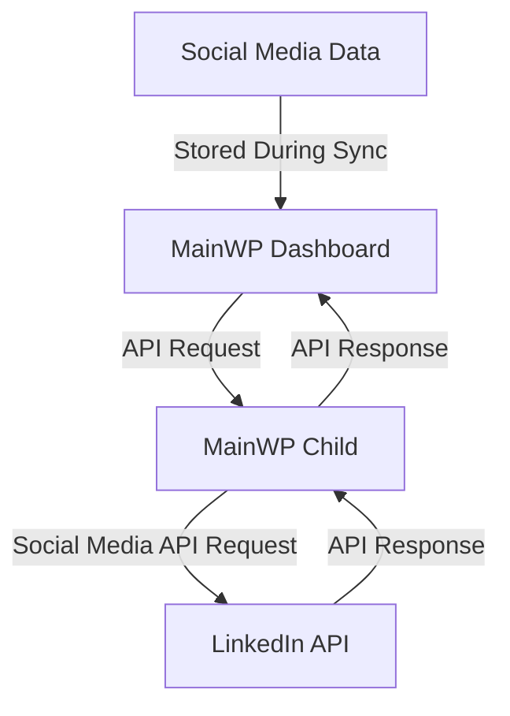

# Creating a MainWP Social Media Integration

This guide walks you through the process of creating a MainWP integration with social media platforms, allowing you to manage and monitor social media content across your MainWP network. We'll focus primarily on LinkedIn as our main example.

> **Quick Start Available**: If you're an experienced developer looking for just the essential code, check out our [Social Media Integration Quick Start Guide](social-media-quick-start.md).

For advanced features and Bluesky integration, see [Part 2 of this guide](social-media-integration-part2.md).

## Prerequisites

Before you begin creating a MainWP social media integration, ensure you have:

- A development environment with WordPress and MainWP Dashboard installed (see [Setting Up a Development Environment](setup-environment.md))
- LinkedIn Developer account with an application created
- LinkedIn API knowledge (familiarity with endpoints and authentication)
- Basic understanding of WordPress plugin development
- Familiarity with PHP object-oriented programming
- A code editor (like VS Code, PhpStorm, or Sublime Text)

## Integration Overview

A MainWP social media integration allows you to centrally manage and monitor social media content across your MainWP network. This provides several benefits:

- **Centralized Content Management**: Manage social media posts from a single dashboard
- **Bulk Operations**: Perform actions across multiple sites simultaneously
- **Unified Analytics**: View engagement and performance data across all sites
- **Consistent Branding**: Maintain consistent messaging across multiple properties
- **Scheduled Publishing**: Plan and schedule content in advance

### Data Flow Architecture

The integration works by communicating between the MainWP Dashboard and social media platforms via child sites:



## Step 1: Setting Up LinkedIn API Access

To communicate with LinkedIn, you'll need to set up API access:

### Creating a LinkedIn Application

1. Go to the [LinkedIn Developer Portal](https://www.linkedin.com/developers/)
2. Click "Create App"
3. Fill in the required information:
   - App name
   - Company page
   - App logo
   - Description
4. Click "Create App"
5. Under "Auth" tab, add authorized redirect URLs (your MainWP Dashboard URL)
6. Request the necessary API permissions:
   - r_organization_social
   - w_organization_social
   - r_liteprofile
7. Note your Client ID and Client Secret

### Implementing OAuth 2.0 Authentication

LinkedIn uses OAuth 2.0 for authentication. Here's how to implement it:

```php
/**
 * Initiate OAuth authentication flow
 */
public function initiate_oauth() {
    // Validate nonce
    check_admin_referer('mainwp_linkedin_oauth_nonce', 'mainwp_linkedin_oauth_nonce');
    
    // Validate website ID
    $website_id = isset($_GET['website_id']) ? absint($_GET['website_id']) : 0;
    if ($website_id <= 0) {
        wp_die('Invalid website ID');
    }
    
    // Get settings
    $settings = get_option('mainwp_linkedin_settings', array());
    $site_settings = isset($settings[$website_id]) ? $settings[$website_id] : array();
    
    if (empty($site_settings['client_id']) || empty($site_settings['client_secret'])) {
        wp_die('LinkedIn API credentials not configured');
    }
    
    // Generate state parameter to prevent CSRF
    $state = wp_generate_password(12, false);
    update_option('mainwp_linkedin_oauth_state_' . $website_id, $state);
    
    // Build authorization URL
    $auth_url = add_query_arg(
        array(
            'response_type' => 'code',
            'client_id' => $site_settings['client_id'],
            'redirect_uri' => urlencode(admin_url('admin.php?page=MainWPLinkedInSettings&action=oauth_callback&website_id=' . $website_id)),
            'state' => $state,
            'scope' => 'r_organization_social w_organization_social r_liteprofile'
        ),
        'https://www.linkedin.com/oauth/v2/authorization'
    );
    
    // Redirect to LinkedIn authorization page
    wp_redirect($auth_url);
    exit;
}

/**
 * Handle OAuth callback
 */
public function handle_oauth_callback() {
    // Validate website ID
    $website_id = isset($_GET['website_id']) ? absint($_GET['website_id']) : 0;
    if ($website_id <= 0) {
        wp_die('Invalid website ID');
    }
    
    // Verify state parameter to prevent CSRF
    $state = get_option('mainwp_linkedin_oauth_state_' . $website_id);
    if (empty($state) || $state !== $_GET['state']) {
        wp_die('Invalid state parameter');
    }
    
    // Clean up state option
    delete_option('mainwp_linkedin_oauth_state_' . $website_id);
    
    // Check for error
    if (isset($_GET['error'])) {
        wp_die('LinkedIn OAuth error: ' . sanitize_text_field($_GET['error_description']));
    }
    
    // Check for authorization code
    if (!isset($_GET['code'])) {
        wp_die('Authorization code not received');
    }
    
    // Get settings
    $settings = get_option('mainwp_linkedin_settings', array());
    $site_settings = isset($settings[$website_id]) ? $settings[$website_id] : array();
    
    if (empty($site_settings['client_id']) || empty($site_settings['client_secret'])) {
        wp_die('LinkedIn API credentials not configured');
    }
    
    // Exchange authorization code for access token
    $response = wp_remote_post('https://www.linkedin.com/oauth/v2/accessToken', array(
        'body' => array(
            'grant_type' => 'authorization_code',
            'code' => $_GET['code'],
            'redirect_uri' => admin_url('admin.php?page=MainWPLinkedInSettings&action=oauth_callback&website_id=' . $website_id),
            'client_id' => $site_settings['client_id'],
            'client_secret' => $site_settings['client_secret']
        )
    ));
    
    if (is_wp_error($response)) {
        wp_die('Error exchanging authorization code: ' . $response->get_error_message());
    }
    
    $body = json_decode(wp_remote_retrieve_body($response), true);
    
    if (!isset($body['access_token'])) {
        wp_die('Access token not received');
    }
    
    // Save access token
    $site_settings['access_token'] = $body['access_token'];
    $site_settings['expires_in'] = $body['expires_in'];
    $site_settings['token_obtained'] = time();
    
    $settings[$website_id] = $site_settings;
    update_option('mainwp_linkedin_settings', $settings);
    
    // Redirect to settings page
    wp_redirect(admin_url('admin.php?page=MainWPLinkedInSettings&oauth_success=1'));
    exit;
}
```

### Storing API Credentials Securely

In your integration, you'll need to securely store these credentials:

```php
/**
 * Save API credentials for a site
 * 
 * @param int $website_id The website ID
 * @param string $client_id LinkedIn API client ID
 * @param string $client_secret LinkedIn API client secret
 * @return bool Success or failure
 */
public function save_api_credentials($website_id, $client_id, $client_secret) {
    // Validate inputs
    $website_id = absint($website_id);
    if ($website_id <= 0) {
        return false;
    }
    
    // Sanitize credentials
    $client_id = sanitize_text_field($client_id);
    $client_secret = sanitize_text_field($client_secret);
    
    // Get current settings
    $settings = get_option('mainwp_linkedin_settings', array());
    
    // Update settings for this site
    $settings[$website_id] = array(
        'client_id' => $client_id,
        'client_secret' => $client_secret
    );
    
    // Save settings
    return update_option('mainwp_linkedin_settings', $settings);
}
```

### Testing API Connectivity

Always test the API connection before performing operations:

```php
/**
 * Test LinkedIn API connection for a site
 * 
 * @param int $website_id The website ID
 * @return bool|string True on success, error message on failure
 */
public function test_api_connection($website_id) {
    // Validate website ID
    $website_id = absint($website_id);
    if ($website_id <= 0) {
        return 'Invalid website ID';
    }
    
    // Get API client
    $api_client = $this->get_api_client($website_id);
    if (!$api_client) {
        return 'API credentials not configured';
    }
    
    try {
        // Try to get user profile
        $result = $api_client->get_user_profile();
        
        if (is_wp_error($result)) {
            $error_message = $result->get_error_message();
            
            // Log error if WP_DEBUG_LOG is enabled
            if (defined('WP_DEBUG_LOG') && WP_DEBUG_LOG) {
                error_log(sprintf(
                    '[MainWP LinkedIn] API connection test failed for website ID %d: %s',
                    $website_id,
                    $error_message
                ));
            }
            
            return $error_message;
        }
        
        return true;
    } catch (\Exception $e) {
        $error_message = $e->getMessage();
        
        // Log exception if WP_DEBUG_LOG is enabled
        if (defined('WP_DEBUG_LOG') && WP_DEBUG_LOG) {
            error_log(sprintf(
                '[MainWP LinkedIn] API connection test exception for website ID %d: %s',
                $website_id,
                $error_message
            ));
        }
        
        return 'Connection error: ' . $error_message;
    }
}
```

## Step 2: Core Integration Components

### LinkedIn API Client

Create a dedicated class for handling API communication:

```php
/**
 * LinkedIn API Client
 */
class LinkedInAPIClient {
    /** @var object Website object */
    private $website;
    /** @var string Client ID */
    private $client_id;
    /** @var string Client secret */
    private $client_secret;
    /** @var string Access token */
    private $access_token;
    /** @var int Cache expiration in seconds */
    private $cache_expiration = 300; // 5 minutes
    /** @var string API version */
    private $api_version = 'v2';
    /** @var string API base URL */
    private $api_base_url = 'https://api.linkedin.com/';
    
    /**
     * Constructor
     * 
     * @param object $website Website object
     * @param string $client_id LinkedIn API client ID
     * @param string $client_secret LinkedIn API client secret
     * @param string $access_token LinkedIn API access token
     */
    public function __construct($website, $client_id, $client_secret, $access_token) {
        $this->website = $website;
        $this->client_id = $client_id;
        $this->client_secret = $client_secret;
        $this->access_token = $access_token;
    }
    
    /**
     * Get user profile
     * 
     * @return array|WP_Error User profile or error
     */
    public function get_user_profile() {
        return $this->make_api_request('me');
    }
    
    /**
     * Get company pages
     * 
     * @return array|WP_Error Company pages or error
     */
    public function get_company_pages() {
        // Check cache first
        $cache_key = 'mainwp_linkedin_company_pages_' . $this->website->id;
        $cached_data = get_transient($cache_key);
        
        if (false !== $cached_data) {
            return $cached_data;
        }
        
        $result = $this->make_api_request('organizationAcls?q=roleAssignee&role=ADMINISTRATOR');
        
        // Cache the result if not an error
        if (!is_wp_error($result)) {
            set_transient($cache_key, $result, $this->cache_expiration);
        }
        
        return $result;
    }
    
    /**
     * Get company page information
     * 
     * @param string $company_id Company ID
     * @return array|WP_Error Company info or error
     */
    public function get_company_info($company_id) {
        // Check cache first
        $cache_key = 'mainwp_linkedin_company_' . $this->website->id . '_' . $company_id;
        $cached_data = get_transient($cache_key);
        
        if (false !== $cached_data) {
            return $cached_data;
        }
        
        $result = $this->make_api_request("organizations/{$company_id}");
        
        // Cache the result if not an error
        if (!is_wp_error($result)) {
            set_transient($cache_key, $result, $this->cache_expiration);
        }
        
        return $result;
    }
    
    /**
     * Get company page posts
     * 
     * @param string $company_id Company ID
     * @param array $args Query arguments
     * @return array|WP_Error Posts or error
     */
    public function get_company_posts($company_id, $args = array()) {
        // Ensure args is an array
        $args = is_array($args) ? $args : array();
        
        // Check cache first
        $cache_key = 'mainwp_linkedin_posts_' . $this->website->id . '_' . $company_id . '_' . md5(serialize($args));
        $cached_data = get_transient($cache_key);
        
        if (false !== $cached_data) {
            return $cached_data;
        }
        
        $result = $this->make_api_request("organizations/{$company_id}/posts", 'GET', $args);
        
        // Cache the result if not an error
        if (!is_wp_error($result)) {
            set_transient($cache_key, $result, $this->cache_expiration);
        }
        
        return $result;
    }
    
    /**
     * Create a company page post
     * 
     * @param string $company_id Company ID
     * @param array $post_data Post data
     * @return array|WP_Error Post data or error
     */
    public function create_company_post($company_id, $post_data) {
        // Clear posts cache
        $this->clear_posts_cache($company_id);
        
        return $this->make_api_request("organizations/{$company_id}/posts", 'POST', $post_data);
    }
    
    /**
     * Clear posts cache for a company
     * 
     * @param string $company_id Company ID
     */
    private function clear_posts_cache($company_id) {
        global $wpdb;
        
        // Find and delete all posts cache transients for this company
        $like = $wpdb->esc_like('_transient_mainwp_linkedin_posts_' . $this->website->id . '_' . $company_id) . '%';
        $wpdb->query($wpdb->prepare("DELETE FROM $wpdb->options WHERE option_name LIKE %s", $like));
    }
    
    /**
     * Make an API request to the LinkedIn REST API
     * 
     * @param string $endpoint API endpoint
     * @param string $method HTTP method
     * @param array $args Request arguments
     * @return array|WP_Error Response or error
     */
    private function make_api_request($endpoint, $method = 'GET', $args = array()) {
        // Prepare the request data for MainWP
        $data = array(
            'linkedin_api' => true,
            'endpoint' => $endpoint,
            'method' => $method,
            'args' => $args,
            'client_id' => $this->client_id,
            'client_secret' => $this->client_secret,
            'access_token' => $this->access_token
        );
        
        try {
            // Send the request through MainWP
            $information = \MainWP\Dashboard\MainWP_Connect::fetch_url_authed(
                $this->website,
                'linkedin_integration',
                $data
            );
            
            // Check for errors in the response
            if (is_array($information) && isset($information['error'])) {
                return new \WP_Error('api_error', $information['error']);
            }
            
            return $information;
        } catch (\Exception $e) {
            return new \WP_Error('api_error', $e->getMessage());
        }
    }
}
```

## Step 3: Content Publishing

Implement content publishing functionality:

```php
/**
 * Content Manager
 */
class ContentManager {
    /** @var LinkedInAPIClient API client */
    private $api_client;
    
    /**
     * Constructor
     * 
     * @param LinkedInAPIClient $api_client API client
     */
    public function __construct($api_client) {
        $this->api_client = $api_client;
    }
    
    /**
     * Create a text post
     * 
     * @param string $company_id Company ID
     * @param string $text Post text
     * @param string $visibility Post visibility (PUBLIC, CONNECTIONS, or LOGGED_IN)
     * @return array|WP_Error Post data or error
     */
    public function create_text_post($company_id, $text, $visibility = 'PUBLIC') {
        $post_data = array(
            'author' => 'urn:li:organization:' . $company_id,
            'lifecycleState' => 'PUBLISHED',
            'specificContent' => array(
                'com.linkedin.ugc.ShareContent' => array(
                    'shareCommentary' => array(
                        'text' => $text
                    ),
                    'shareMediaCategory' => 'NONE'
                )
            ),
            'visibility' => array(
                'com.linkedin.ugc.MemberNetworkVisibility' => $visibility
            )
        );
        
        return $this->api_client->create_company_post($company_id, $post_data);
    }
    
    /**
     * Create a post with an image
     * 
     * @param string $company_id Company ID
     * @param string $text Post text
     * @param string $image_url Image URL
     * @param string $title Image title
     * @param string $description Image description
     * @param string $visibility Post visibility (PUBLIC, CONNECTIONS, or LOGGED_IN)
     * @return array|WP_Error Post data or error
     */
    public function create_image_post($company_id, $text, $image_url, $title, $description, $visibility = 'PUBLIC') {
        $post_data = array(
            'author' => 'urn:li:organization:' . $company_id,
            'lifecycleState' => 'PUBLISHED',
            'specificContent' => array(
                'com.linkedin.ugc.ShareContent' => array(
                    'shareCommentary' => array(
                        'text' => $text
                    ),
                    'shareMediaCategory' => 'IMAGE',
                    'media' => array(
                        array(
                            'status' => 'READY',
                            'description' => array(
                                'text' => $description
                            ),
                            'media' => $image_url,
                            'title' => array(
                                'text' => $title
                            )
                        )
                    )
                )
            ),
            'visibility' => array(
                'com.linkedin.ugc.MemberNetworkVisibility' => $visibility
            )
        );
        
        return $this->api_client->create_company_post($company_id, $post_data);
    }
    
    /**
     * Create a post with a link
     * 
     * @param string $company_id Company ID
     * @param string $text Post text
     * @param string $link_url Link URL
     * @param string $title Link title
     * @param string $description Link description
     * @param string $thumbnail_url Thumbnail URL
     * @param string $visibility Post visibility (PUBLIC, CONNECTIONS, or LOGGED_IN)
     * @return array|WP_Error Post data or error
     */
    public function create_link_post($company_id, $text, $link_url, $title, $description, $thumbnail_url, $visibility = 'PUBLIC') {
        $post_data = array(
            'author' => 'urn:li:organization:' . $company_id,
            'lifecycleState' => 'PUBLISHED',
            'specificContent' => array(
                'com.linkedin.ugc.ShareContent' => array(
                    'shareCommentary' => array(
                        'text' => $text
                    ),
                    'shareMediaCategory' => 'ARTICLE',
                    'media' => array(
                        array(
                            'status' => 'READY',
                            'description' => array(
                                'text' => $description
                            ),
                            'originalUrl' => $link_url,
                            'title' => array(
                                'text' => $title
                            ),
                            'thumbnails' => array(
                                array(
                                    'url' => $thumbnail_url
                                )
                            )
                        )
                    )
                )
            ),
            'visibility' => array(
                'com.linkedin.ugc.MemberNetworkVisibility' => $visibility
            )
        );
        
        return $this->api_client->create_company_post($company_id, $post_data);
    }
    
    /**
     * Schedule a post
     * 
     * @param string $company_id Company ID
     * @param array $post_data Post data
     * @param int $timestamp Timestamp to publish the post
     * @return bool Success or failure
     */
    public function schedule_post($company_id, $post_data, $timestamp) {
        // Validate timestamp
        if ($timestamp <= time()) {
            return new \WP_Error('invalid_timestamp', 'Scheduled time must be in the future');
        }
        
        // Get scheduled posts
        $scheduled_posts = get_option('mainwp_linkedin_scheduled_posts', array());
        
        // Add new scheduled post
        $scheduled_posts[] = array(
            'company_id' => $company_id,
            'post_data' => $post_data,
            'timestamp' => $timestamp
        );
        
        // Save scheduled posts
        return update_option('mainwp_linkedin_scheduled_posts', $scheduled_posts);
    }
}
```

## Best Practices for Social Media Integration

### Security Best Practices

1. **Secure API Credentials**: Store API credentials securely and never expose them in client-side code:
   ```php
   // Use WordPress options API for storing credentials
   update_option('mainwp_linkedin_settings', $settings, true); // true = autoload
   
   // For extra security, consider encrypting sensitive data
   function encrypt_data($data, $key) {
       $iv = openssl_random_pseudo_bytes(openssl_cipher_iv_length('aes-256-cbc'));
       $encrypted = openssl_encrypt($data, 'aes-256-cbc', $key, 0, $iv);
       return base64_encode($encrypted . '::' . $iv);
   }
   
   function decrypt_data($data, $key) {
       list($encrypted_data, $iv) = explode('::', base64_decode($data), 2);
       return openssl_decrypt($encrypted_data, 'aes-256-cbc', $key, 0, $iv);
   }
   ```

2. **Validate All User Input**: Sanitize and validate all user-provided data before using it in API requests:
   ```php
   // Validate and sanitize text input
   $text = sanitize_textarea_field($_POST['post_text']);
   if (empty($text)) {
       return new \WP_Error('empty_text', 'Post text cannot be empty');
   }
   
   // Validate image URLs
   $image_url = esc_url_raw($_POST['image_url']);
   if (!filter_var($image_url, FILTER_VALIDATE_URL)) {
       return new \WP_Error('invalid_url', 'Invalid image URL');
   }
   ```

3. **Use Proper Authentication**: Implement OAuth 2.0 correctly for LinkedIn:
   ```php
   // For LinkedIn, always verify state parameter to prevent CSRF
   if (empty($state) || $state !== $_GET['state']) {
       wp_die('Invalid state parameter');
   }
   ```

### Performance Best Practices

1. **Implement Smart Caching**: Cache API responses to reduce API calls and improve performance:
   ```php
   // Cache API responses with appropriate expiration times
   $cache_key = 'mainwp_linkedin_company_' . $website_id . '_' . $company_id;
   $cached_data = get_transient($cache_key);
   
   if (false !== $cached_data) {
       return $cached_data;
   }
   
   // Make API request
   $result = $this->make_api_request("organizations/{$company_id}");
   
   // Cache the result if not an error
   if (!is_wp_error($result)) {
       set_transient($cache_key, $result, $this->cache_expiration);
   }
   ```

2. **Use Pagination for Large Datasets**: Always implement pagination when retrieving large datasets:
   ```php
   // Get posts with pagination
   $posts = $api_client->get_company_posts($company_id, array(
       'start' => $offset,
       'count' => $per_page
   ));
   ```

3. **Implement Defensive Programming**: Always validate data and handle edge cases:
   ```php
   // Ensure args is an array
   $args = is_array($args) ? $args : array();
   
   // Check for errors before processing
   if (is_wp_error($posts) || !is_array($posts)) {
       return array();
   }
   ```

## Next Steps

For advanced features, including Bluesky integration, analytics, background processing, and webhook handling, see [Part 2 of this guide](social-media-integration-part2.md).
