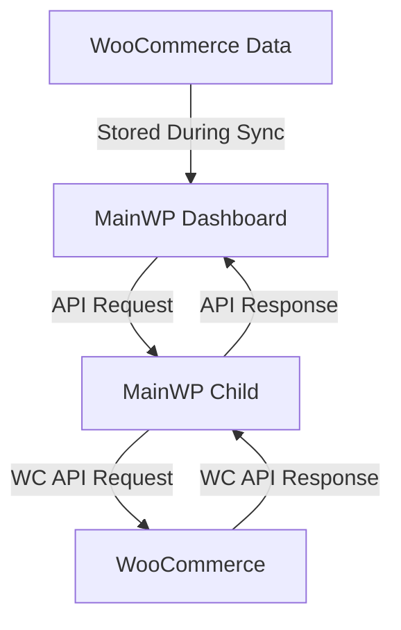

# Creating a MainWP WooCommerce Integration

This guide walks you through the process of creating a MainWP integration with WooCommerce, allowing you to manage and monitor WooCommerce stores across your MainWP network.

> **Quick Start Available**: If you're an experienced developer looking for just the essential code, check out our [WooCommerce Integration Quick Start Guide](woocommerce-quick-start.md).

For advanced features and implementation details, see [Part 2 of this guide](woocommerce-integration-part2.md).

## Prerequisites

Before you begin creating a MainWP WooCommerce integration, ensure you have:

- A development environment with WordPress and MainWP Dashboard installed (see [Setting Up a Development Environment](setup-environment.md))
- WooCommerce installed on at least one child site
- WooCommerce REST API knowledge (familiarity with endpoints and authentication)
- Basic understanding of WordPress plugin development
- Familiarity with PHP object-oriented programming
- A code editor (like VS Code, PhpStorm, or Sublime Text)

## Integration Overview

A MainWP WooCommerce integration allows you to centrally manage and monitor WooCommerce stores across your MainWP network. This provides several benefits:

- **Centralized Store Management**: Manage products, orders, and customers from a single dashboard
- **Bulk Operations**: Perform actions across multiple stores simultaneously
- **Unified Reporting**: View sales and performance data across all stores
- **Synchronized Inventory**: Keep product stock levels in sync across multiple stores
- **Consistent Product Data**: Maintain consistent product information across your network

### Data Flow Architecture

The integration works by communicating between the MainWP Dashboard and WooCommerce on child sites:



## Step 1: Setting Up WooCommerce API Access

To communicate with WooCommerce on child sites, you'll need to set up API access:

### Creating API Keys on Child Sites

For each child site, you'll need to create WooCommerce API keys:

1. On the child site, go to WooCommerce → Settings → Advanced → REST API
2. Click "Add key"
3. Enter a description (e.g., "MainWP Integration")
4. Set permissions to "Read/Write"
5. Click "Generate API key"
6. Save the Consumer Key and Consumer Secret

### Storing API Credentials Securely

In your integration, you'll need to securely store these credentials:

```php
/**
 * Save API credentials for a site
 * 
 * @param int $website_id The website ID
 * @param string $consumer_key WooCommerce API consumer key
 * @param string $consumer_secret WooCommerce API consumer secret
 * @return bool Success or failure
 */
public function save_api_credentials($website_id, $consumer_key, $consumer_secret) {
    // Validate inputs
    $website_id = absint($website_id);
    if ($website_id <= 0) {
        return false;
    }
    
    // Sanitize credentials
    $consumer_key = sanitize_text_field($consumer_key);
    $consumer_secret = sanitize_text_field($consumer_secret);
    
    // Get current settings
    $settings = get_option('mainwp_woocommerce_settings', array());
    
    // Update settings for this site
    $settings[$website_id] = array(
        'consumer_key' => $consumer_key,
        'consumer_secret' => $consumer_secret
    );
    
    // Save settings
    return update_option('mainwp_woocommerce_settings', $settings);
}
```

### Testing API Connectivity

Always test the API connection before performing operations:

```php
/**
 * Test WooCommerce API connection for a site
 * 
 * @param int $website_id The website ID
 * @return bool|string True on success, error message on failure
 */
public function test_api_connection($website_id) {
    // Validate website ID
    $website_id = absint($website_id);
    if ($website_id <= 0) {
        return 'Invalid website ID';
    }
    
    // Get API client
    $api_client = $this->get_api_client($website_id);
    if (!$api_client) {
        return 'API credentials not configured';
    }
    
    try {
        // Try to get store information
        $result = $api_client->get_store_info();
        
        if (is_wp_error($result)) {
            $error_message = $result->get_error_message();
            
            // Log error if WP_DEBUG_LOG is enabled
            if (defined('WP_DEBUG_LOG') && WP_DEBUG_LOG) {
                error_log(sprintf(
                    '[MainWP WooCommerce] API connection test failed for website ID %d: %s',
                    $website_id,
                    $error_message
                ));
            }
            
            return $error_message;
        }
        
        return true;
    } catch (\Exception $e) {
        $error_message = $e->getMessage();
        
        // Log exception if WP_DEBUG_LOG is enabled
        if (defined('WP_DEBUG_LOG') && WP_DEBUG_LOG) {
            error_log(sprintf(
                '[MainWP WooCommerce] API connection test exception for website ID %d: %s',
                $website_id,
                $error_message
            ));
        }
        
        return 'Connection error: ' . $error_message;
    }
}
```

## Step 2: Core Integration Components

### WooCommerce API Client

Create a dedicated class for handling API communication:

```php
/**
 * WooCommerce API Client
 */
class WooCommerceAPIClient {
    /** @var object Website object */
    private $website;
    /** @var string Consumer key */
    private $consumer_key;
    /** @var string Consumer secret */
    private $consumer_secret;
    /** @var int Cache expiration in seconds */
    private $cache_expiration = 300; // 5 minutes
    
    /**
     * Constructor
     * 
     * @param object $website Website object
     * @param string $consumer_key WooCommerce API consumer key
     * @param string $consumer_secret WooCommerce API consumer secret
     */
    public function __construct($website, $consumer_key, $consumer_secret) {
        $this->website = $website;
        $this->consumer_key = $consumer_key;
        $this->consumer_secret = $consumer_secret;
    }
    
    /**
     * Get store information
     * 
     * @return array|WP_Error Store info or error
     */
    public function get_store_info() {
        return $this->make_api_request('');
    }
    
    /**
     * Get products from the WooCommerce store
     * 
     * @param array $args Query arguments
     * @return array|WP_Error Products or error
     */
    public function get_products($args = array()) {
        // Check cache first
        $cache_key = 'mainwp_wc_products_' . $this->website->id . '_' . md5(serialize($args));
        $cached_data = get_transient($cache_key);
        
        if (false !== $cached_data) {
            return $cached_data;
        }
        
        // Make API request
        $products = $this->make_api_request('products', 'GET', $args);
        
        // Cache the result if not an error
        if (!is_wp_error($products)) {
            set_transient($cache_key, $products, $this->cache_expiration);
        }
        
        return $products;
    }
    
    /**
     * Get orders from the WooCommerce store
     * 
     * @param array $args Query arguments
     * @return array|WP_Error Orders or error
     */
    public function get_orders($args = array()) {
        // For orders, use a shorter cache time or no cache for recent orders
        $use_cache = !isset($args['after']) || strtotime($args['after']) < (time() - 3600);
        
        if ($use_cache) {
            $cache_key = 'mainwp_wc_orders_' . $this->website->id . '_' . md5(serialize($args));
            $cached_data = get_transient($cache_key);
            
            if (false !== $cached_data) {
                return $cached_data;
            }
        }
        
        // Make API request
        $orders = $this->make_api_request('orders', 'GET', $args);
        
        // Cache the result if using cache and not an error
        if ($use_cache && !is_wp_error($orders)) {
            set_transient($cache_key, $orders, $this->cache_expiration);
        }
        
        return $orders;
    }
    
    /**
     * Update a product on the WooCommerce store
     * 
     * @param int $product_id Product ID
     * @param array $data Product data
     * @return array|WP_Error Updated product or error
     */
    public function update_product($product_id, $data) {
        // Clear product cache
        $this->clear_product_cache();
        
        return $this->make_api_request("products/{$product_id}", 'PUT', $data);
    }
    
    /**
     * Clear product cache
     */
    private function clear_product_cache() {
        global $wpdb;
        
        // Find and delete all product cache transients for this site
        $like = $wpdb->esc_like('_transient_mainwp_wc_products_' . $this->website->id) . '%';
        $wpdb->query($wpdb->prepare("DELETE FROM $wpdb->options WHERE option_name LIKE %s", $like));
    }
    
    /**
     * Make an API request to the WooCommerce REST API
     * 
     * @param string $endpoint API endpoint
     * @param string $method HTTP method
     * @param array $args Request arguments
     * @return array|WP_Error Response or error
     */
    private function make_api_request($endpoint, $method = 'GET', $args = array()) {
        // Prepare the request data for MainWP
        $data = array(
            'wc_api' => true,
            'endpoint' => $endpoint,
            'method' => $method,
            'args' => $args,
            'consumer_key' => $this->consumer_key,
            'consumer_secret' => $this->consumer_secret
        );
        
        try {
            // Send the request through MainWP
            $information = \MainWP\Dashboard\MainWP_Connect::fetch_url_authed(
                $this->website,
                'woocommerce_integration',
                $data
            );
            
            // Check for errors in the response
            if (is_array($information) && isset($information['error'])) {
                return new \WP_Error('api_error', $information['error']);
            }
            
            return $information;
        } catch (\Exception $e) {
            return new \WP_Error('api_error', $e->getMessage());
        }
    }
}
```

### Data Models

Create models for WooCommerce data:

```php
/**
 * Product Model
 */
class Product {
    /** @var int Product ID */
    public $id;
    /** @var string Product name */
    public $name;
    /** @var string Product slug */
    public $slug;
    /** @var string Product permalink */
    public $permalink;
    /** @var string Date created */
    public $date_created;
    /** @var string Date modified */
    public $date_modified;
    /** @var string Product type */
    public $type;
    /** @var string Product status */
    public $status;
    /** @var bool Featured status */
    public $featured;
    /** @var string Catalog visibility */
    public $catalog_visibility;
    /** @var string Product description */
    public $description;
    /** @var string Short description */
    public $short_description;
    /** @var string SKU */
    public $sku;
    /** @var string Price */
    public $price;
    /** @var string Regular price */
    public $regular_price;
    /** @var string Sale price */
    public $sale_price;
    /** @var string Date on sale from */
    public $date_on_sale_from;
    /** @var string Date on sale to */
    public $date_on_sale_to;
    /** @var bool Virtual product */
    public $virtual;
    /** @var bool Downloadable product */
    public $downloadable;
    /** @var array Downloads */
    public $downloads;
    /** @var int Download limit */
    public $download_limit;
    /** @var int Download expiry */
    public $download_expiry;
    /** @var string Tax status */
    public $tax_status;
    /** @var string Tax class */
    public $tax_class;
    /** @var bool Manage stock */
    public $manage_stock;
    /** @var int|null Stock quantity */
    public $stock_quantity;
    /** @var string Stock status */
    public $stock_status;
    /** @var string Backorders */
    public $backorders;
    /** @var bool Backorders allowed */
    public $backorders_allowed;
    /** @var bool Backordered */
    public $backordered;
    /** @var bool Sold individually */
    public $sold_individually;
    /** @var string Weight */
    public $weight;
    /** @var array Dimensions */
    public $dimensions;
    /** @var bool Shipping required */
    public $shipping_required;
    /** @var bool Shipping taxable */
    public $shipping_taxable;
    /** @var string Shipping class */
    public $shipping_class;
    /** @var int Shipping class ID */
    public $shipping_class_id;
    /** @var bool Reviews allowed */
    public $reviews_allowed;
    /** @var string Average rating */
    public $average_rating;
    /** @var int Rating count */
    public $rating_count;
    /** @var array Related IDs */
    public $related_ids;
    /** @var array Upsell IDs */
    public $upsell_ids;
    /** @var array Cross sell IDs */
    public $cross_sell_ids;
    /** @var int Parent ID */
    public $parent_id;
    /** @var string Purchase note */
    public $purchase_note;
    /** @var array Categories */
    public $categories;
    /** @var array Tags */
    public $tags;
    /** @var array Images */
    public $images;
    /** @var array Attributes */
    public $attributes;
    /** @var array Default attributes */
    public $default_attributes;
    /** @var array Variations */
    public $variations;
    /** @var array Grouped products */
    public $grouped_products;
    /** @var int Menu order */
    public $menu_order;
    
    /**
     * Create a product from API data
     * 
     * @param array $data Product data from API
     * @return Product Product object
     */
    public static function from_api_data($data) {
        $product = new self();
        
        // Map API data to object properties
        foreach ($data as $key => $value) {
            if (property_exists($product, $key)) {
                $product->$key = $value;
            }
        }
        
        return $product;
    }
}

/**
 * Order Model
 */
class Order {
    /** @var int Order ID */
    public $id;
    /** @var int Parent ID */
    public $parent_id;
    /** @var string Order number */
    public $number;
    /** @var string Order key */
    public $order_key;
    /** @var string Created via */
    public $created_via;
    /** @var string Version */
    public $version;
    /** @var string Status */
    public $status;
    /** @var string Currency */
    public $currency;
    /** @var string Date created */
    public $date_created;
    /** @var string Date modified */
    public $date_modified;
    /** @var string Discount total */
    public $discount_total;
    /** @var string Discount tax */
    public $discount_tax;
    /** @var string Shipping total */
    public $shipping_total;
    /** @var string Shipping tax */
    public $shipping_tax;
    /** @var string Cart tax */
    public $cart_tax;
    /** @var string Total */
    public $total;
    /** @var string Total tax */
    public $total_tax;
    /** @var bool Prices include tax */
    public $prices_include_tax;
    /** @var int Customer ID */
    public $customer_id;
    /** @var string Customer note */
    public $customer_note;
    /** @var array Billing details */
    public $billing;
    /** @var array Shipping details */
    public $shipping;
    /** @var string Payment method */
    public $payment_method;
    /** @var string Payment method title */
    public $payment_method_title;
    /** @var string Transaction ID */
    public $transaction_id;
    /** @var string Customer IP address */
    public $customer_ip_address;
    /** @var string Customer user agent */
    public $customer_user_agent;
    /** @var array Line items */
    public $line_items;
    /** @var array Tax lines */
    public $tax_lines;
    /** @var array Shipping lines */
    public $shipping_lines;
    /** @var array Fee lines */
    public $fee_lines;
    /** @var array Coupon lines */
    public $coupon_lines;
    /** @var array Refunds */
    public $refunds;
    
    /**
     * Create an order from API data
     * 
     * @param array $data Order data from API
     * @return Order Order object
     */
    public static function from_api_data($data) {
        $order = new self();
        
        // Map API data to object properties
        foreach ($data as $key => $value) {
            if (property_exists($order, $key)) {
                $order->$key = $value;
            }
        }
        
        return $order;
    }
}
```

### Caching Strategy

Implement caching to improve performance and reduce API calls:

```php
/**
 * Cache manager for WooCommerce data
 */
class CacheManager {
    /** @var int Default cache expiration in seconds */
    private $default_expiration = 300; // 5 minutes
    
    /**
     * Get cached data
     * 
     * @param string $key Cache key
     * @return mixed|false Cached data or false if not found
     */
    public function get($key) {
        return get_transient($key);
    }
    
    /**
     * Set cached data
     * 
     * @param string $key Cache key
     * @param mixed $data Data to cache
     * @param int|null $expiration Cache expiration in seconds
     * @return bool Success or failure
     */
    public function set($key, $data, $expiration = null) {
        if (null === $expiration) {
            $expiration = $this->default_expiration;
        }
        
        return set_transient($key, $data, $expiration);
    }
    
    /**
     * Delete cached data
     * 
     * @param string $key Cache key
     * @return bool Success or failure
     */
    public function delete($key) {
        return delete_transient($key);
    }
    
    /**
     * Delete all cache for a specific site
     * 
     * @param int $website_id Website ID
     * @return void
     */
    public function clear_site_cache($website_id) {
        global $wpdb;
        
        // Find and delete all cache transients for this site
        $like = $wpdb->esc_like('_transient_mainwp_wc_') . $website_id . '%';
        $wpdb->query($wpdb->prepare("DELETE FROM $wpdb->options WHERE option_name LIKE %s", $like));
    }
}
```

## Step 3: Implementing Key Features

### Product Management

Implement product management functionality:

```php
/**
 * Product Manager
 */
class ProductManager {
    /** @var WooCommerceAPIClient API client */
    private $api_client;
    
    /**
     * Constructor
     * 
     * @param WooCommerceAPIClient $api_client API client
     */
    public function __construct($api_client) {
        $this->api_client = $api_client;
    }
    
    /**
     * Get products
     * 
     * @param array $args Query arguments
     * @return array Products
     */
    public function get_products($args = array()) {
        $products = $this->api_client->get_products($args);
        
        if (is_wp_error($products)) {
            return array();
        }
        
        // Convert to product objects
        $product_objects = array();
        foreach ($products as $product_data) {
            $product_objects[] = Product::from_api_data($product_data);
        }
        
        return $product_objects;
    }
    
    /**
     * Get a single product
     * 
     * @param int $product_id Product ID
     * @return Product|null Product or null on failure
     */
    public function get_product($product_id) {
        $product = $this->api_client->make_api_request("products/{$product_id}");
        
        if (is_wp_error($product)) {
            return null;
        }
        
        return Product::from_api_data($product);
    }
    
    /**
     * Update a product
     * 
     * @param int $product_id Product ID
     * @param array $data Product data
     * @return Product|WP_Error Updated product or error
     */
    public function update_product($product_id, $data) {
        $result = $this->api_client->update_product($product_id, $data);
        
        if (is_wp_error($result)) {
            return $result;
        }
        
        return Product::from_api_data($result);
    }
    
    /**
     * Update product stock
     * 
     * @param int $product_id Product ID
     * @param int $stock_quantity Stock quantity
     * @return Product|WP_Error Updated product or error
     */
    public function update_stock($product_id, $stock_quantity) {
        return $this->update_product($product_id, array(
            'stock_quantity' => $stock_quantity
        ));
    }
    
    /**
     * Bulk update products
     * 
     * @param array $products Array of product IDs and data
     * @return array Results
     */
    public function bulk_update_products($products) {
        $results = array();
        
        foreach ($products as $product) {
            if (!isset($product['id']) || !isset($product['data'])) {
                continue;
            }
            
            $result = $this->update_product($product['id'], $product['data']);
            
            $results[] = array(
                'id' => $product['id'],
                'success' => !is_wp_error($result),
                'message' => is_wp_error($result) ? $result->get_error_message() : 'Success'
            );
        }
        
        return $results;
    }
}
```

### Order Monitoring

Implement order monitoring functionality:

```php
/**
 * Order Manager
 */
class OrderManager {
    /** @var WooCommerceAPIClient API client */
    private $api_client;
    
    /**
     * Constructor
     * 
     * @param WooCommerceAPIClient $api_client API client
     */
    public function __construct($api_client) {
        $this->api_client = $api_client;
    }
    
    /**
     * Get orders
     * 
     * @param array $args Query arguments
     * @return array Orders
     */
    public function get_orders($args = array()) {
        $orders = $this->api_client->get_orders($args);
        
        if (is_wp_error($orders)) {
            return array();
        }
        
        // Convert to order objects
        $order_objects = array();
        foreach ($orders as $order_data) {
            $order_objects[] = Order::from_api_data($order_data);
        }
        
        return $order_objects;
    }
    
    /**
     * Get a single order
     * 
     * @param int $order_id Order ID
     * @return Order|null Order or null on failure
     */
    public function get_order($order_id) {
        $order = $this->api_client->make_api_request("orders/{$order_id}");
        
        if (is_wp_error($order)) {
            return null;
        }
        
        return Order::from_api_data($order);
    }
}
```

## Best Practices for WooCommerce Integration

When developing your WooCommerce integration, consider these best practices:

### Security Best Practices

1. **Use HTTPS**: Always ensure your MainWP Dashboard and child sites use HTTPS to protect API credentials during transmission.

2. **Validate All User Input**: Sanitize and validate all user-provided data before using it in database queries or API requests:
   ```php
   // Validate website ID
   $website_id = absint($website_id);
   if ($website_id <= 0) {
       return false;
   }
   
   // Sanitize API credentials
   $consumer_key = sanitize_text_field($consumer_key);
   $consumer_secret = sanitize_text_field($consumer_secret);
   ```

3. **Use Appropriate Capability Checks**: Ensure admin pages use `manage_options` capability instead of just `read`:
   ```php
   // Check if user has permissions
   if (!current_user_can('manage_options')) {
       wp_die(__('You do not have sufficient permissions to access this page.', 'mainwp-woocommerce'));
       return;
   }
   ```

### Performance Best Practices

1. **Implement Smart Caching**: Adjust cache expiration times based on data volatility. For example, product data might be cached longer than order data:
   ```php
   // For relatively static data like products
   set_transient($cache_key, $products, 3600); // 1 hour
   
   // For more volatile data like recent orders
   set_transient($cache_key, $orders, 300); // 5 minutes
   ```

2. **Use Pagination for Large Datasets**: Always implement pagination when retrieving large datasets to avoid memory issues and timeout errors:
   ```php
   $products = $api_client->get_products(array(
       'page' => $page,
       'per_page' => 100
   ));
   ```

3. **Implement Defensive Programming**: Always validate data and handle edge cases:
   ```php
   // Ensure args is an array
   $args = is_array($args) ? $args : array();
   
   // Check for errors before processing
   if (is_wp_error($products) || !is_array($products)) {
       return array();
   }
   ```

## Step 4: Advanced Integration Techniques

For advanced integration techniques and more detailed examples, please see [Part 2 of this guide](woocommerce-integration-part2.md).

This continuation covers:
- Handling WooCommerce Webhooks
- Implementing Background Processing
- Synchronizing Inventory Across Stores
- Common Challenges and Solutions
- A Complete WooCommerce Integration Example
- Next Steps and Resources
