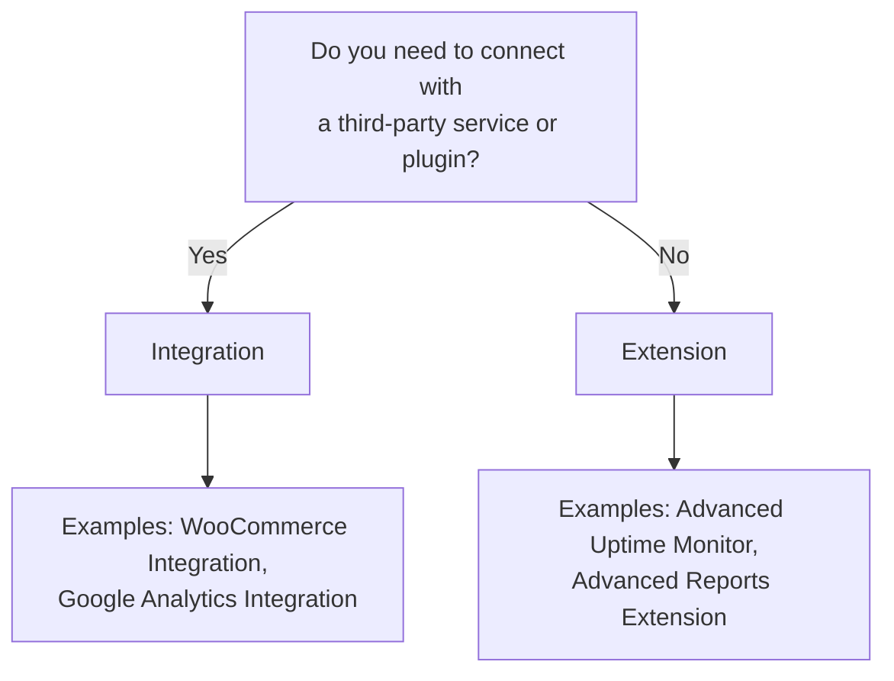

# MainWP Developer Guides

Welcome to the MainWP Developer Guides! This documentation is designed to help you create add-ons for the MainWP platform, whether you're building a standalone extension or integrating with a third-party service.

## Understanding MainWP Add-on Types

MainWP uses specific terminology to distinguish between different types of add-ons:

- **Add-on**: The umbrella term for all MainWP plugins that extend functionality
- **Extension**: An add-on that works WITHOUT requiring a third-party plugin or API
- **Integration**: An add-on that works WITH a third-party plugin or API

## Which Type Should You Build?

Use this decision tree to determine whether you should build an Extension or an Integration:

## Who These Guides Are For

These guides are intended for developers who want to:

- Create custom add-ons for MainWP (both standalone extensions and third-party integrations)
- Customize MainWP functionality for specific needs
- Understand the MainWP architecture and development patterns

Whether you're new to MainWP development or an experienced developer looking for specific information, you'll find resources tailored to your needs. We've optimized these guides for part-time developers who want to create MainWP add-ons efficiently.

## Guide Categories

### [Getting Started](getting-started/)

Essential information for beginning your MainWP development journey:

- [Setting Up a Development Environment](how-to/setup-environment.md)
- [Creating a Basic Extension](how-to/create-basic-extension.md) (standalone add-on)
- [Creating a Basic Integration](how-to/create-basic-integration.md) (third-party add-on)
- [Understanding the MainWP Development Extension](how-to/mainwp-development-extension.md)
- [Add-on Development Lifecycle](concepts/extension-lifecycle.md)

### [Core Development Topics](core-topics/)

Detailed guides for key development areas:

- [Building Admin Interfaces](how-to/admin-interfaces.md)
- [Data Storage and Retrieval](how-to/data-storage.md)
- [Using MainWP Actions & Filters](how-to/actions-filters.md)
- [Debugging Add-ons](how-to/debugging.md)
- [Packaging and Distribution](how-to/packaging-distribution.md)
- [Working with Third-Party APIs](how-to/third-party-apis.md) (for Integrations)

### [Best Practices](best-practices/)

Recommendations for creating high-quality MainWP add-ons:

- [Writing Clean & Maintainable Code](best-practices/coding-standards.md)
- [Security Considerations](best-practices/security.md)
- [Performance Optimization](best-practices/performance.md)
- [Documentation Standards](best-practices/documentation.md)
- [API Integration Best Practices](best-practices/api-integration.md)

### [Reference](reference/)

Technical reference material:

- [Common Hooks Reference](reference/common-hooks.md)
- [Add-on API Reference](reference/extension-api.md)
- [MainWP Dashboard Integration Points](reference/dashboard-integration.md)
- [Child Site Communication](reference/child-site-communication.md)
- [Third-Party API Integration Patterns](reference/api-integration-patterns.md)

## Additional Resources

- [MainWP Dashboard API Documentation](../source-code/dashboard/)
- [MainWP Child API Documentation](../source-code/child/)
- [MainWP Dashboard Hooks](../mainwp-hooks/dashboard/)
- [MainWP Child Hooks](../mainwp-hooks/child/)
- [MainWP Development Extension on GitHub](https://github.com/mainwp/mainwp-development-extension)
- [MainWP API Client PHP on GitHub](https://github.com/mainwp/mainwp-api-client-php)

## How to Use These Guides

Each guide is structured to provide information at different levels of detail:

- **Quick Start** sections provide essential information for experienced developers
- **Detailed Explanations** help new developers understand concepts thoroughly
- **Code Examples** demonstrate practical implementation with copy-paste snippets
- **Reference Links** connect to API documentation and source code
- **Troubleshooting Tips** help you overcome common challenges

We've designed these guides with part-time developers in mind. If you're creating a MainWP add-on as a side project, you'll find:

- Clear, concise guides that respect your time constraints
- Separate pathways for Extension and Integration development
- Ready-to-use code snippets that you can adapt for your needs
- Practical implementation guidance focused on results
- Common pitfalls and their solutions to avoid getting stuck

Use the navigation to find the specific information you need, or follow the guides sequentially for a comprehensive learning path.
