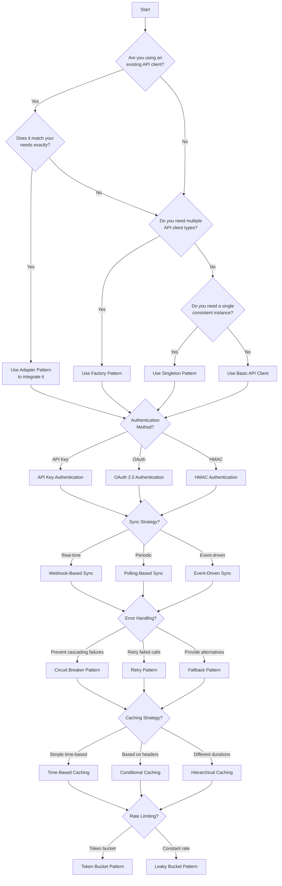

# API Integration Patterns for MainWP Extensions

This reference guide documents common patterns and architectures for integrating third-party APIs with MainWP extensions. These patterns provide proven solutions to recurring integration challenges.

## Pattern Selection Decision Tree

Use this decision tree to help you choose the right pattern for your integration needs:



## Overview

When integrating third-party APIs with MainWP, you'll encounter common challenges that have established solutions. This guide documents these patterns to help you implement robust, maintainable integrations.

## API Client Patterns

### Singleton API Client

The Singleton pattern ensures only one instance of the API client exists throughout the application lifecycle.

```php
class ApiClient {
    private static $instance = null;
    private $api_key;
    private $api_url;
    
    private function __construct($api_key, $api_url) {
        $this->api_key = $api_key;
        $this->api_url = $api_url;
    }
    
    public static function getInstance($api_key = null, $api_url = null) {
        if (self::$instance === null) {
            if ($api_key === null) {
                $api_key = get_option('my_extension_api_key', '');
            }
            
            if ($api_url === null) {
                $api_url = get_option('my_extension_api_url', 'https://api.example.com/v1');
            }
            
            self::$instance = new self($api_key, $api_url);
        }
        
        return self::$instance;
    }
    
    // API methods...
}

// Usage
$api_client = ApiClient::getInstance();
$data = $api_client->get('endpoint');
```

**When to use**: When you need a single, consistent API client throughout your extension.

### Factory API Client

The Factory pattern creates different API client instances based on configuration or context.

```php
class ApiClientFactory {
    public static function create($type, $config = []) {
        switch ($type) {
            case 'oauth':
                return new OAuthApiClient(
                    $config['client_id'] ?? '',
                    $config['client_secret'] ?? '',
                    $config['redirect_uri'] ?? ''
                );
            
            case 'api_key':
                return new ApiKeyClient(
                    $config['api_key'] ?? ''
                );
            
            case 'basic_auth':
                return new BasicAuthClient(
                    $config['username'] ?? '',
                    $config['password'] ?? ''
                );
            
            default:
                throw new Exception("Unknown API client type: $type");
        }
    }
}

// Usage
$oauth_client = ApiClientFactory::create('oauth', [
    'client_id' => 'your_client_id',
    'client_secret' => 'your_client_secret',
    'redirect_uri' => 'your_redirect_uri'
]);
```

**When to use**: When your extension needs to support multiple authentication methods or API versions.

### Adapter API Client

The Adapter pattern wraps a third-party API client to provide a consistent interface.

```php
// Third-party library
class ThirdPartyClient {
    public function sendRequest($method, $endpoint, $params) {
        // Implementation...
    }
    
    public function setAuthToken($token) {
        // Implementation...
    }
}

// Adapter
class ApiClientAdapter {
    private $client;
    
    public function __construct($api_key) {
        $this->client = new ThirdPartyClient();
        $this->client->setAuthToken($api_key);
    }
    
    public function get($endpoint, $params = []) {
        return $this->client->sendRequest('GET', $endpoint, $params);
    }
    
    public function post($endpoint, $data = []) {
        return $this->client->sendRequest('POST', $endpoint, $data);
    }
    
    // Other methods...
}

// Usage
$api_client = new ApiClientAdapter('your_api_key');
$data = $api_client->get('endpoint');
```

**When to use**: When integrating with a third-party API client library that has a different interface than your extension's API client.

## Authentication Patterns

### API Key Authentication

The simplest authentication pattern, using a single API key.

```php
class ApiKeyClient {
    private $api_key;
    private $api_url;
    
    public function __construct($api_key, $api_url = 'https://api.example.com/v1') {
        $this->api_key = $api_key;
        $this->api_url = $api_url;
    }
    
    public function request($method, $endpoint, $params = [], $data = null) {
        $url = $this->api_url . '/' . ltrim($endpoint, '/');
        
        $args = [
            'method' => $method,
            'headers' => [
                'Authorization' => 'Bearer ' . $this->api_key,
                'Content-Type' => 'application/json',
                'Accept' => 'application/json'
            ]
        ];
        
        // Add query parameters
        if (!empty($params)) {
            $url = add_query_arg($params, $url);
        }
        
        // Add body data
        if ($data !== null) {
            $args['body'] = json_encode($data);
        }
        
        // Make request
        $response = wp_remote_request($url, $args);
        
        // Process response...
        
        return $result;
    }
}
```

**When to use**: For simple APIs that use a single API key for authentication.

### OAuth 2.0 Authentication

A more complex authentication pattern for APIs that use OAuth 2.0.

```php
class OAuth2Client {
    private $client_id;
    private $client_secret;
    private $redirect_uri;
    private $auth_url;
    private $token_url;
    private $api_url;
    private $access_token;
    private $refresh_token;
    private $token_expires;
    
    public function __construct($client_id, $client_secret, $redirect_uri, $auth_url, $token_url, $api_url) {
        $this->client_id = $client_id;
        $this->client_secret = $client_secret;
        $this->redirect_uri = $redirect_uri;
        $this->auth_url = $auth_url;
        $this->token_url = $token_url;
        $this->api_url = $api_url;
        
        // Load tokens from options
        $this->access_token = get_option('my_extension_access_token', '');
        $this->refresh_token = get_option('my_extension_refresh_token', '');
        $this->token_expires = get_option('my_extension_token_expires', 0);
    }
    
    public function get_auth_url($scope = [], $state = '') {
        $params = [
            'client_id' => $this->client_id,
            'redirect_uri' => $this->redirect_uri,
            'response_type' => 'code',
            'state' => $state ?: wp_create_nonce('oauth2_state')
        ];
        
        if (!empty($scope)) {
            $params['scope'] = implode(' ', $scope);
        }
        
        return add_query_arg($params, $this->auth_url);
    }
    
    public function exchange_code_for_tokens($code) {
        $args = [
            'method' => 'POST',
            'headers' => [
                'Content-Type' => 'application/x-www-form-urlencoded'
            ],
            'body' => [
                'grant_type' => 'authorization_code',
                'code' => $code,
                'client_id' => $this->client_id,
                'client_secret' => $this->client_secret,
                'redirect_uri' => $this->redirect_uri
            ]
        ];
        
        $response = wp_remote_post($this->token_url, $args);
        
        // Process response and save tokens...
        
        return true;
    }
    
    public function refresh_access_token() {
        // Implementation...
    }
    
    public function request($method, $endpoint, $params = [], $data = null) {
        // Check if token is expired and refresh if needed
        if (time() > $this->token_expires - 60) {
            $this->refresh_access_token();
        }
        
        $url = $this->api_url . '/' . ltrim($endpoint, '/');
        
        $args = [
            'method' => $method,
            'headers' => [
                'Authorization' => 'Bearer ' . $this->access_token,
                'Content-Type' => 'application/json',
                'Accept' => 'application/json'
            ]
        ];
        
        // Add query parameters and body data...
        
        // Make request
        $response = wp_remote_request($url, $args);
        
        // Process response...
        
        return $result;
    }
}
```

**When to use**: For APIs that require OAuth 2.0 authentication, especially when user authorization is needed.

### HMAC Authentication

A secure authentication pattern for APIs that require request signing.

```php
class HmacClient {
    private $api_key;
    private $api_secret;
    private $api_url;
    
    public function __construct($api_key, $api_secret, $api_url = 'https://api.example.com/v1') {
        $this->api_key = $api_key;
        $this->api_secret = $api_secret;
        $this->api_url = $api_url;
    }
    
    public function request($method, $endpoint, $params = [], $data = null) {
        $url = $this->api_url . '/' . ltrim($endpoint, '/');
        $timestamp = time();
        $nonce = wp_generate_password(12, false);
        
        // Add query parameters
        if (!empty($params)) {
            $url = add_query_arg($params, $url);
        }
        
        // Create signature base string
        $signature_base = $method . "\n" . 
                          parse_url($url, PHP_URL_HOST) . "\n" . 
                          parse_url($url, PHP_URL_PATH) . "\n" . 
                          ($data ? json_encode($data) : '') . "\n" . 
                          $timestamp . "\n" . 
                          $nonce;
        
        // Create signature
        $signature = base64_encode(hash_hmac('sha256', $signature_base, $this->api_secret, true));
        
        $args = [
            'method' => $method,
            'headers' => [
                'X-API-Key' => $this->api_key,
                'X-Signature' => $signature,
                'X-Timestamp' => $timestamp,
                'X-Nonce' => $nonce,
                'Content-Type' => 'application/json',
                'Accept' => 'application/json'
            ]
        ];
        
        // Add body data
        if ($data !== null) {
            $args['body'] = json_encode($data);
        }
        
        // Make request
        $response = wp_remote_request($url, $args);
        
        // Process response...
        
        return $result;
    }
}
```

**When to use**: For APIs that require request signing for enhanced security.

## Data Synchronization Patterns

### Webhook-Based Sync

Synchronize data in real-time using webhooks.

```php
class WebhookSyncHandler {
    public function __construct() {
        // Register webhook endpoint
        add_action('rest_api_init', [$this, 'register_webhook_endpoint']);
    }
    
    public function register_webhook_endpoint() {
        register_rest_route('my-extension/v1', '/webhook', [
            'methods' => 'POST',
            'callback' => [$this, 'process_webhook'],
            'permission_callback' => [$this, 'verify_webhook']
        ]);
    }
    
    public function verify_webhook($request) {
        // Get signature from header
        $signature = $request->get_header('X-Webhook-Signature');
        if (empty($signature)) {
            return false;
        }
        
        // Get webhook secret
        $secret = get_option('my_extension_webhook_secret', '');
        if (empty($secret)) {
            return false;
        }
        
        // Get request body
        $body = $request->get_body();
        
        // Calculate expected signature
        $expected_signature = hash_hmac('sha256', $body, $secret);
        
        // Compare signatures
        return hash_equals($expected_signature, $signature);
    }
    
    public function process_webhook($request) {
        // Get request data
        $data = $request->get_json_params();
        
        // Process webhook data
        $event_type = $data['event_type'] ?? '';
        $resource_id = $data['resource_id'] ?? '';
        
        switch ($event_type) {
            case 'site.updated':
                // Find MainWP website ID from resource ID
                $website_id = $this->get_website_id_from_resource_id($resource_id);
                if ($website_id) {
                    // Sync data from service
                    $this->sync_from_service($website_id);
                }
                break;
            
            case 'site.deleted':
                // Handle site deletion
                $website_id = $this->get_website_id_from_resource_id($resource_id);
                if ($website_id) {
                    delete_option('my_extension_data_' . $website_id);
                }
                break;
            
            // Handle other event types
        }
        
        return new WP_REST_Response(['status' => 'success'], 200);
    }
    
    private function get_website_id_from_resource_id($resource_id) {
        // Implementation...
    }
    
    private function sync_from_service($website_id) {
        // Implementation...
    }
}
```

**When to use**: When you need real-time data synchronization and the third-party API supports webhooks.

### Polling-Based Sync

Synchronize data by periodically polling the API.

```php
class PollingSyncHandler {
    public function __construct() {
        // Register cron event
        add_action('my_extension_sync_cron', [$this, 'sync_all_websites']);
        
        // Schedule cron event if not already scheduled
        if (!wp_next_scheduled('my_extension_sync_cron')) {
            wp_schedule_event(time(), 'hourly', 'my_extension_sync_cron');
        }
    }
    
    public function sync_all_websites() {
        // Get all MainWP websites
        $websites = MainWP\Dashboard\MainWP_DB::instance()->get_websites();
        
        foreach ($websites as $website) {
            // Check if extension is enabled for this website
            $enabled = get_option('my_extension_enabled_' . $website->id, false);
            if (!$enabled) {
                continue;
            }
            
            // Get last sync timestamp
            $last_sync = get_option('my_extension_last_sync_' . $website->id, 0);
            
            // Sync data
            $this->sync_website($website->id, $last_sync);
            
            // Update last sync timestamp
            update_option('my_extension_last_sync_' . $website->id, time());
        }
    }
    
    private function sync_website($website_id, $last_sync) {
        // Get website details
        $website = MainWP\Dashboard\MainWP_DB::instance()->get_website_by_id($website_id);
        if (!$website) {
            return;
        }
        
        // Get API client
        $api_client = ApiClient::getInstance();
        
        // Get changes since last sync
        $changes = $api_client->get('sites/' . urlencode($website->url) . '/changes', [
            'since' => $last_sync
        ]);
        
        // Process changes
        foreach ($changes as $change) {
            // Process change...
        }
    }
}
```

**When to use**: When the third-party API doesn't support webhooks or when you need more control over the synchronization process.

### Event-Driven Sync

Synchronize data based on MainWP events.

```php
class EventDrivenSyncHandler {
    public function __construct() {
        // Register event handlers
        add_action('mainwp_site_added', [$this, 'handle_site_added'], 10, 1);
        add_action('mainwp_site_updated', [$this, 'handle_site_updated'], 10, 1);
        add_action('mainwp_site_deleted', [$this, 'handle_site_deleted'], 10, 1);
        add_action('mainwp_site_synced', [$this, 'handle_site_synced'], 10, 2);
    }
    
    public function handle_site_added($website_id) {
        // Get website details
        $website = MainWP\Dashboard\MainWP_DB::instance()->get_website_by_id($website_id);
        if (!$website) {
            return;
        }
        
        // Get API client
        $api_client = ApiClient::getInstance();
        
        // Create site in third-party service
        $api_client->post('sites', [
            'url' => $website->url,
            'name' => $website->name
        ]);
    }
    
    public function handle_site_updated($website_id) {
        // Implementation...
    }
    
    public function handle_site_deleted($website_id) {
        // Implementation...
    }
    
    public function handle_site_synced($website, $data) {
        // Implementation...
    }
}
```

**When to use**: When you need to synchronize data based on MainWP events.

## Error Handling Patterns

### Circuit Breaker Pattern

The Circuit Breaker pattern acts like an electrical circuit breaker - it automatically stops API calls when too many failures occur, preventing a cascade of errors that could crash your system. After a cooling-off period, it cautiously allows calls again to see if the problem is resolved.

```php
class CircuitBreaker {
    private $failures = 0;
    private $threshold = 5;
    private $reset_timeout = 60;
    private $last_failure_time = 0;
    private $state = 'closed'; // closed, open, half-open
    
    public function execute($func) {
        // Check if circuit is open
        if ($this->is_open()) {
            // Check if reset timeout has passed
            if (time() - $this->last_failure_time > $this->reset_timeout) {
                // Set circuit to half-open
                $this->state = 'half-open';
            } else {
                throw new Exception('Circuit is open');
            }
        }
        
        try {
            // Execute function
            $result = $func();
            
            // Reset failures on success
            if ($this->state === 'half-open') {
                $this->reset();
            }
            
            return $result;
        } catch (Exception $e) {
            // Increment failures
            $this->failures++;
            $this->last_failure_time = time();
            
            // Open circuit if threshold is reached
            if ($this->failures >= $this->threshold) {
                $this->state = 'open';
            }
            
            throw $e;
        }
    }
    
    public function is_open() {
        return $this->state === 'open';
    }
    
    public function reset() {
        $this->failures = 0;
        $this->state = 'closed';
    }
}

// Usage
$circuit_breaker = new CircuitBreaker();
try {
    $result = $circuit_breaker->execute(function() use ($api_client) {
        return $api_client->get('endpoint');
    });
} catch (Exception $e) {
    // Handle error
}
```

**When to use**: When you need to prevent cascading failures in your extension.

### Retry Pattern

The Retry Pattern automatically attempts failed API calls again, using a smart "exponential backoff" approach - waiting a little longer between each retry. This gives temporary API issues time to resolve themselves without requiring manual intervention.

```php
class RetryHandler {
    private $max_retries;
    
    public function __construct($max_retries = 3) {
        $this->max_retries = $max_retries;
    }
    
    public function execute($func, $retry_count = 0) {
        try {
            return $func();
        } catch (ApiRateLimitException $e) {
            // Handle rate limiting
            $retry_after = $e->getRetryAfter();
            if ($retry_count < $this->max_retries) {
                sleep($retry_after);
                return $this->execute($func, $retry_count + 1);
            }
            throw $e;
        } catch (ApiServerException $e) {
            // Handle server errors
            if ($retry_count < $this->max_retries) {
                $backoff = pow(2, $retry_count);
                sleep($backoff);
                return $this->execute($func, $retry_count + 1);
            }
            throw $e;
        } catch (ApiConnectionException $e) {
            // Handle connection errors
            if ($retry_count < $this->max_retries) {
                $backoff = pow(2, $retry_count);
                sleep($backoff);
                return $this->execute($func, $retry_count + 1);
            }
            throw $e;
        }
    }
}

// Usage
$retry_handler = new RetryHandler();
try {
    $result = $retry_handler->execute(function() use ($api_client) {
        return $api_client->get('endpoint');
    });
} catch (Exception $e) {
    // Handle error
}
```

**When to use**: When you need to automatically retry failed API calls.

### Fallback Pattern

The Fallback Pattern is like having a backup plan - when an API call fails, it automatically provides alternative data from a cache or predefined defaults. This ensures your application continues to function even when the external service is unavailable, giving users a smoother experience.

```php
class FallbackHandler {
    private $api_client;
    
    public function __construct($api_client) {
        $this->api_client = $api_client;
    }
    
    public function get_with_fallback($endpoint, $params = []) {
        try {
            // Try to get data from API
            return $this->api_client->get($endpoint, $params);
        } catch (Exception $e) {
            // Log error
            error_log('API Error: ' . $e->getMessage());
            
            // Try to get cached data
            $cache_key = 'my_extension_' . md5($endpoint . serialize($params));
            $cached = get_transient($cache_key);
            if (false !== $cached) {
                return $cached;
            }
            
            // Return fallback data
            return $this->get_fallback_data($endpoint);
        }
    }
    
    private function get_fallback_data($endpoint) {
        // Return default data based on endpoint
        switch ($endpoint) {
            case 'users':
                return ['status' => 'offline', 'data' => []];
            case 'stats':
                return ['status' => 'offline', 'data' => ['visits' => 0, 'conversions' => 0]];
            default:
                return ['status' => 'offline', 'data' => []];
        }
    }
}

// Usage
$fallback_handler = new FallbackHandler($api_client);
$data = $fallback_handler->get_with_fallback('endpoint');
```

**When to use**: When you need to provide fallback data when the API is unavailable.

## Caching Patterns

### Time-Based Caching

Cache API responses for a fixed period of time.

```php
class TimeCacheHandler {
    private $api_client;
    
    public function __construct($api_client) {
        $this->api_client = $api_client;
    }
    
    public function get_cached($endpoint, $params = [], $cache_time = 300) {
        $cache_key = 'my_extension_' . md5($endpoint . serialize($params));
        
        // Check cache
        $cached = get_transient($cache_key);
        if (false !== $cached) {
            return $cached;
        }
        
        // Get fresh data
        $data = $this->api_client->get($endpoint, $params);
        
        // Cache the data
        set_transient($cache_key, $data, $cache_time);
        
        return $data;
    }
    
    public function invalidate_cache($endpoint, $params = []) {
        $cache_key = 'my_extension_' . md5($endpoint . serialize($params));
        delete_transient($cache_key);
    }
}

// Usage
$cache_handler = new TimeCacheHandler($api_client);
$data = $cache_handler->get_cached('endpoint');
```

**When to use**: When you need to cache API responses for a fixed period of time.

### Conditional Caching

Cache API responses based on ETag or Last-Modified headers.

```php
class ConditionalCacheHandler {
    private $api_client;
    
    public function __construct($api_client) {
        $this->api_client = $api_client;
    }
    
    public function get_cached($endpoint, $params = []) {
        $cache_key = 'my_extension_' . md5($endpoint . serialize($params));
        $etag_key = $cache_key . '_etag';
        $last_modified_key = $cache_key . '_last_modified';
        
        // Get cached data and headers
        $cached = get_transient($cache_key);
        $etag = get_transient($etag_key);
        $last_modified = get_transient($last_modified_key);
        
        // Prepare headers for conditional request
        $headers = [];
        if ($etag) {
            $headers['If-None-Match'] = $etag;
        }
        if ($last_modified) {
            $headers['If-Modified-Since'] = $last_modified;
        }
        
        // Make conditional request
        $response = $this->api_client->request('GET', $endpoint, $params, null, $headers);
        
        // Check if response is 304 Not Modified
        if ($response['status'] === 304) {
            // Return cached data
            return $cached;
        }
        
        // Get new data
        $data = $response['data'];
        
        // Get new headers
        $new_etag = $response['headers']['etag'] ?? '';
        $new_last_modified = $response['headers']['last-modified'] ?? '';
        
        // Cache data and headers
        set_transient($cache_key, $data, DAY_IN_SECONDS);
        if ($new_etag) {
            set_transient($etag_key, $new_etag, DAY_IN_SECONDS);
        }
        if ($new_last_modified) {
            set_transient($last_modified_key, $new_last_modified, DAY_IN_SECONDS);
        }
        
        return $data;
    }
}

// Usage
$cache_handler = new ConditionalCacheHandler($api_client);
$data = $cache_handler->get_cached('endpoint');
```

**When to use**: When the API supports conditional requests with ETag or Last-Modified headers.

### Hierarchical Caching

Cache different types of data for different durations.

```php
class HierarchicalCacheHandler {
    private $api_client;
    private $cache_durations;
    
    public function __construct($api_client, $cache_durations = []) {
        $this->api_client = $api_client;
        $this->cache_durations = array_merge([
            'user' => 60,           // User data: 1 minute
            'posts' => 300,         // Posts: 5 minutes
            'comments' => 180,      // Comments: 3 minutes
            'settings' => 3600,     // Settings: 1 hour
            'static' => 86400       // Static data: 24 hours
        ], $cache_durations);
    }
    
    public function get_cached($endpoint, $params = []) {
        $cache_key = 'my_extension_' . md5($endpoint . serialize($params));
        
        // Check cache
        $cached = get_transient($cache_key);
        if (false !== $cached) {
            return $cached;
        }
        
        // Get fresh data
        $data = $this->api_client->get($endpoint, $params);
        
        // Determine cache duration
        $cache_time = $this->get_cache_duration($endpoint);
        
        // Cache the data
        set_transient($cache_key, $data, $cache_time);
        
        return $data;
    }
    
    private function get_cache_duration($endpoint) {
        foreach ($this->cache_durations as $key => $duration) {
            if (strpos($endpoint, $key) !== false) {
                return $duration;
            }
        }
        
        return 300; // Default: 5 minutes
    }
}

// Usage
$cache_handler = new HierarchicalCacheHandler($api_client);
$data = $cache_handler->get_cached('endpoint');
```

**When to use**: When you need to cache different types of data for different durations.

## Rate Limiting Patterns

### Token Bucket Pattern

Limit API requests using a token bucket algorithm.

```php
class TokenBucketRateLimiter {
    private $bucket_size;
    private $refill_rate;
    private $available_tokens;
    private $last_refill_time;
    private $option_name;
    
    public function __construct($bucket_size = 60, $refill_rate = 1, $option_name = 'my_extension_rate_limit') {
        $this->bucket_size = $bucket_size;
        $this->refill_rate = $refill_rate;
        $this->option_name = $option_name;
        
        // Load state
        $state = get_option($option_name, [
            'available_tokens' => $bucket_size,
            'last_refill_time' => time()
        ]);
        
        $this->available_tokens = $state['available_tokens'];
        $this->last_refill_time = $state['last_refill_time'];
        
        // Refill tokens based on elapsed time
        $this->refill_tokens();
    }
    
    private function refill_tokens() {
        $now = time();
        $elapsed = $now - $this->last_refill_time;
        
        if ($elapsed > 0) {
            $new_tokens = $elapsed * $this->refill_rate;
            $this->available_tokens = min($this->bucket_size, $this->available_tokens + $new_tokens);
            $this->last_refill_time = $now;
            
            // Save state
            update_option($this->option_name, [
                'available_tokens' => $this->available_tokens,
                'last_refill_time' => $this->last_refill_time
            ]);
        }
    }
    
    public function can_make_request($tokens = 1) {
        $this->refill_tokens();
        return $this->available_tokens >= $tokens;
    }
    
    public function consume_tokens($tokens = 1) {
        if (!$this->can_make_request($tokens)) {
            return false;
        }
        
        $this->available_tokens -= $tokens;
        
        // Save state
        update_option($this->option_name, [
            'available_tokens' => $this->available_tokens,
            'last_refill_time' => $this->last_refill_time
        ]);
        
        return true;
    }
    
    public function get_wait_time($tokens = 1) {
        $this->refill_tokens();
        
        if ($this->available_tokens >= $tokens) {
            return 0;
        }
        
        $tokens_needed = $tokens - $this->available_tokens;
        return ceil($tokens_needed / $this->refill_rate);
    }
}

// Usage
$rate_limiter = new TokenBucketRateLimiter(60, 1); // 60 requests per minute
if ($rate_limiter->can_make_request()) {
    $data = $api_client->get('endpoint');
    $rate_limiter->consume_tokens();
} else {
    $wait_time = $rate_limiter->get_wait_time();
    error_log("Rate limit exceeded. Try again in $wait_time seconds.");
}
```

**When to use**: When you need to limit the rate of API requests to avoid hitting API rate limits.

### Leaky Bucket Pattern

Limit API requests using a leaky bucket algorithm.

```php
class LeakyBucketRateLimiter {
    private $queue = [];
    private $processing = false;
    private $rate;
    private $option_name;
    
    public function __construct($rate = 1, $option_name = 'my_extension_leaky_bucket') {
        $this->rate = $rate; // Requests per second
        $this->option_name = $option_name;
        
        // Load queue from options
        $this->queue = get_option($option_name, []);
        
        // Start processing queue if not empty
        if (!empty($this->queue) && !$this->processing) {
            $this->process_queue();
        }
    }
    
    public function add_request($method, $endpoint, $params = [], $data = null, $callback = null) {
        // Add request to queue
        $this->queue[] = [
            'method' => $method,
            'endpoint' => $endpoint,
            'params' => $params,
            'data' => $data,
            'callback' => $callback,
            'added_at' => time()
        ];
        
        // Save queue
        update_option($this->option_name, $this->queue);
        
        // Start processing queue if not already processing
        if (!$this->processing) {
            $this->process_queue();
        }
    }
    
    private function process_queue() {
        $this->processing = true;
        
        // Process first request in queue
        if (!empty($this->queue)) {
            $request = array_shift($this->queue);
            
            // Save updated queue
            update_option($this->option_name, $this->queue);
            
            // Process request
            try {
                $api_client = ApiClient::getInstance();
                $result = $api_client->request(
                    $request['method'],
                    $request['endpoint'],
                    $request['params'],
                    $request['data']
                );
                
                // Call callback if provided
                if (is_callable($request['callback'])) {
                    call_user_func($request['callback'], $result);
                }
            } catch (Exception $e) {
                error_log('API Error: ' . $e->getMessage());
            }
            
            // Schedule next request
            wp_schedule_single_event(time() + (1 / $this->rate), 'my_extension_process_queue');
        } else {
            $this->processing = false;
        }
    }
}

// Usage
$leaky_bucket = new LeakyBucketRateLimiter(1); // 1 request per second
$leaky_bucket->add_request('GET', 'endpoint', [], null, function($result) {
    // Process result
});
```

**When to use**: When you need to process API requests at a constant rate.

## Conclusion

These patterns provide proven solutions to common challenges when integrating third-party APIs with MainWP extensions. By leveraging these patterns, you can create robust, maintainable integrations that provide a great user experience.

Remember that these patterns are not mutually exclusive - you can combine them to create a solution that meets your specific needs. For example, you might use the Singleton API Client pattern with the Circuit Breaker pattern and Time-Based Caching to create a robust API client that handles failures gracefully and optimizes performance.
